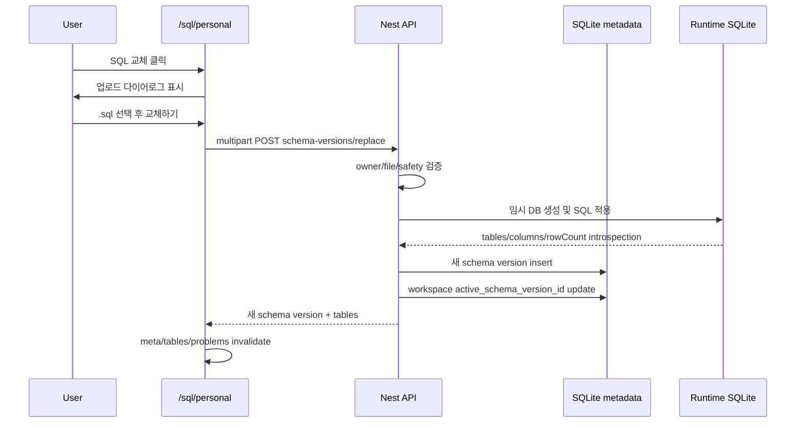

# ERD 버튼 왼쪽에 SQL 파일 교체 다이어로그 버튼 추가 구현 계획

## 목표

`/sql/personal`의 오른쪽 테이블 패널 상단에서 `ERD` 버튼 왼쪽에 `SQL 교체` 버튼을 추가한다.

버튼을 클릭하면 다이어로그가 열리고, 로그인한 사용자가 `.sql` 파일을 업로드해 개인 SQL 연습장의 active DB 파일을 교체할 수 있게 한다.

단, 실제 데이터 모델은 “덮어쓰기”가 아니라 새 `schema version`을 만들고 workspace의 `active_schema_version_id`를 새 버전으로 바꾸는 방식으로 구현한다. 기존 문제와 기존 공유 링크는 생성 당시의 schema version을 계속 사용해야 한다.

## 핵심 UX

```text
오른쪽 테이블 패널

테이블                         [SQL 교체] [ERD]
personal-practice.sqlite

schema: v1
tables: 11
hash: f076b2d805
```

`SQL 교체` 클릭 시:

1. 업로드 다이어로그 오픈
2. `.sql` 파일 선택
3. 파일명, 예상 새 버전, 현재 버전 정보 표시
4. 경고 문구 표시
   - 새 문제는 새 DB 기준으로 생성됨
   - 기존 문제/공유 링크는 기존 DB 기준 유지
5. `교체하기` 클릭
6. 서버에서 SQL 검증 및 새 schema version 생성
7. active schema version 갱신
8. 오른쪽 테이블 목록, schema 정보, 문제 목록 refresh

## 정책

### MVP 범위

- `.sql` 파일만 허용
- `.sqlite`, `.db` 직접 업로드는 제외
- ERD 자동 생성은 제외
- 업로드 SQL에서 생성되는 테이블/컬럼/row count introspection까지 구현
- 업로드 후 문제 자동 마이그레이션은 하지 않음
- 기존 문제를 새 schema version으로 옮기는 기능은 하지 않음

### 보존 규칙

```text
schema version 1에서 만든 문제 A
schema version 1에서 공유한 링크 A

SQL 파일 교체 -> schema version 2 active

문제 A: 계속 version 1 기준 채점
링크 A: 계속 version 1 기준 풀이
새 문제 B: version 2 기준 생성/채점
```

이 원칙 때문에 `sql_personal_practice_schema_versions` row를 수정하지 않고 새 row를 추가한다.

## 백엔드 구현 계획

### 1. `towercrane-for-uiux-server/src/sql-practice/sql-practice.schemas.ts`

추가 타입/검증:

```ts
replacePersonalSchemaVersionSchema
```

multipart 업로드라 body schema는 최소화한다.

검증 항목:

- `title?: string`
- `description?: string`
- 파일은 controller interceptor에서 받음
- 파일 확장자 `.sql`
- 파일 크기 제한은 service에서 최종 확인

### 2. `towercrane-for-uiux-server/src/sql-practice/sql-practice.controller.ts`

개인 workspace 인증 컨트롤러에 endpoint 추가:

```text
POST /api/sql/personal/workspaces/:workspaceId/schema-versions/replace
Content-Type: multipart/form-data
file: File
title?: string
description?: string
```

Nest 구현:

- `@UseInterceptors(FileInterceptor('file'))`
- `@UploadedFile()` 사용
- `@Req()`에서 로그인 userId 사용
- service로 `workspaceId`, `file`, `body`, `userId` 전달

주의:

- 공개 공유 controller에는 업로드 endpoint를 만들지 않는다.
- 공유 받은 사람은 파일 교체 권한이 없다.

### 3. `towercrane-for-uiux-server/src/sql-practice/sql-practice.service.ts`

추가 public method:

```ts
replacePersonalPracticeSchemaVersion(
  workspaceId: string,
  file: Express.Multer.File,
  input: ReplacePersonalSchemaVersionInput,
  userId: string,
): SqlPersonalPracticeSchemaVersion
```

동작 순서:

1. `assertPersonalWorkspaceOwner(workspaceId, userId)`
2. 현재 active schema version 조회
3. 파일 존재/크기/확장자 검증
4. SQL 문자열 읽기
5. SQL safety 검사
6. 임시 runtime DB에 SQL 적용
7. `listTableNames`, `getColumns`, `getRowCount`로 introspection 가능 여부 확인
8. 테이블이 1개 이상인지 확인
9. `hashSql(schemaSql)` 계산
10. workspace 내 다음 version 번호 계산
11. `sql_personal_practice_schema_versions` insert
12. workspace `active_schema_version_id` update
13. 새 schema version 반환

추가 private helper:

```ts
validateUploadedPersonalSqlFile(file)
validatePersonalSchemaSql(schemaSql)
getNextPersonalSchemaVersion(workspaceId)
createPersonalSchemaVersionFromSql(...)
```

SQL 적용 방식:

- 임시 runtime user id를 사용한다.
- `buildPersonalPracticeSeed`와 `ensureDatabaseFresh` 구조를 재사용한다.
- 검증 실패 시 새 schema version row를 만들지 않는다.

위험 SQL 제한:

- `ATTACH`
- `DETACH`
- `PRAGMA writable_schema`
- extension load
- 파일 접근성 있는 sqlite 기능

기존 `sanitizeSql`은 단일 쿼리 실행용이라 schema SQL 전체 검증에는 부족하다. 업로드 SQL은 별도 `sql-upload-safety` 성격의 helper를 두거나 service 내부에서 최소 제한 검사를 먼저 둔다.

### 4. `towercrane-for-uiux-server/src/sql-practice/sql-practice.types.ts`

응답 타입 추가:

```ts
export type SqlPersonalPracticeSchemaReplaceResponse = {
  workspace: SqlPersonalPracticeWorkspace;
  schemaVersion: SqlPersonalPracticeSchemaVersion;
  tableCount: number;
  tables: TableInfo[];
};
```

프론트가 교체 직후 테이블 목록/버전 정보를 즉시 갱신할 수 있게 한다.

### 5. `towercrane-for-uiux-server/src/database/schema.ts`

현재 `sql_personal_practice_schema_versions`에 필요한 기본 컬럼은 이미 있다.

이미 있는 컬럼:

- `schemaSql`
- `erdMmd`
- `dbFileHash`
- `sourceType`
- `sourceFileName`
- `replacedFromSchemaVersionId`

필요하면 후속으로만 추가:

- `fileSizeBytes`
- `tableCount`
- `activatedAt`

MVP에서는 migration 없이 기존 컬럼으로 구현한다.

### 6. `towercrane-for-uiux-server/src/database/database.service.ts`

DB schema SQL이 이미 위 컬럼을 만들고 있으면 변경 없음.

단, `source_type = uploaded_sql`이 저장될 수 있어야 한다.

추가 검토:

- workspace/version unique index가 이미 있으면 그대로 사용
- active schema version FK는 현재 nullable text로 운용 중이므로 service에서 정합성 보장

## 프론트 구현 계획

### 1. `towercrane-for-uiux-front/src/entities/sql-practice/model/types.ts`

타입 추가:

```ts
export type SqlPersonalPracticeSchemaReplaceResponse = {
  workspace: SqlPersonalPracticeWorkspace
  schemaVersion: SqlPersonalPracticeSchemaVersion
  tableCount: number
  tables: TableInfo[]
}
```

### 2. `towercrane-for-uiux-front/src/entities/sql-practice/api/sql-practice-api.ts`

API method 추가:

```ts
replacePersonalSchemaVersion: (
  workspaceId: string,
  payload: {
    file: File
    title?: string
    description?: string
  },
) => Promise<SqlPersonalPracticeSchemaReplaceResponse>
```

구현:

- `FormData` 사용
- 이 요청은 `Content-Type: application/json`을 넣으면 안 됨
- 현재 `apiRequest`는 기본적으로 JSON content-type을 넣는다.
- 따라서 `apiRequest`에 `formData` 옵션을 추가하거나 이 API만 별도 `fetch` helper를 만든다.

권장:

```ts
apiRequest`에 body가 FormData면 Content-Type 자동 생략
```

이렇게 해야 브라우저가 boundary를 자동 설정한다.

### 3. `towercrane-for-uiux-front/src/features/sql-practice/model/use-sql-practice-queries.ts`

mutation 추가:

```ts
useReplaceSqlPersonalPracticeSchemaVersion(workspaceId?: string)
```

성공 시 invalidate:

- `personalDefaultWorkspace`
- `personalMeta(workspaceId)`
- `personalTables(workspaceId)`
- `personalErd(workspaceId)`
- `personalProblems(workspaceId, currentFilter)`

정확한 filter invalidate가 복잡하면 prefix invalidate로 `['sql-practice', 'personal']` 계열을 갱신한다.

### 4. `towercrane-for-uiux-front/src/pages/sql-practice/ui/sql-user-practice-page.tsx`

`SqlPersonalPracticeWorkspace`에 상태 추가:

```ts
const [replaceSqlOpen, setReplaceSqlOpen] = useState(false)
```

오른쪽 테이블 패널 header 변경:

```tsx
<div className="flex items-center gap-2">
  <button>SQL 교체</button>
  <button>ERD</button>
</div>
```

위치:

- `ERD` 버튼 왼쪽
- 개인 연습장에만 표시
- `/sql/user`에는 표시하지 않음
- 공유 공개 페이지에도 표시하지 않음

버튼 스타일:

- `ui-icon-button h-8 px-3 text-xs`
- 아이콘은 `Upload` 또는 `FileUp` from `lucide-react`
- ERD 버튼과 높이 동일

교체 성공 후:

- `setSelectedProblemId(null)` 권장
- `setLastResult(null)`
- `setGradeResult(null)`
- `setSelectedTable(null)`
- active schema version 기준으로 문제 목록/테이블 새로고침

### 5. 신규 컴포넌트 권장

파일:

```text
towercrane-for-uiux-front/src/pages/sql-practice/ui/sql-personal-schema-replace-dialog.tsx
```

props:

```ts
type SqlPersonalSchemaReplaceDialogProps = {
  open: boolean
  workspaceTitle: string
  currentVersion?: SqlPersonalPracticeSchemaVersion
  isPending: boolean
  onSubmit: (input: {
    file: File
    title?: string
    description?: string
  }) => Promise<void>
  onClose: () => void
}
```

UI 구성:

- 현재 DB 정보
  - `v현재버전`
  - hash
  - 파일명/source
- 파일 선택 input
- 업로드 파일명 표시
- title input
- description textarea
- 경고 박스
  - 기존 문제/공유 링크 유지
  - 새 문제부터 새 SQL 기준
- action
  - 취소
  - 교체하기

검증:

- file required
- `.sql`만 허용
- pending 중 버튼 disabled

### 6. `towercrane-for-uiux-front/src/shared/api/http.ts`

FormData 지원 보강:

현재는 항상:

```ts
'Content-Type': 'application/json'
```

로 들어간다. FormData 업로드에서는 이 헤더가 있으면 multipart boundary가 깨질 수 있다.

수정 방향:

```ts
const isFormData = init?.body instanceof FormData

headers: {
  ...(isFormData ? {} : { 'Content-Type': 'application/json' }),
  ...
}
```

## 데이터 흐름



## 에러 처리

서버 에러 메시지:

- 파일이 없습니다.
- `.sql` 파일만 업로드할 수 있습니다.
- SQL 파일 크기가 너무 큽니다.
- SQL 적용 중 오류가 발생했습니다.
- 생성된 테이블이 없습니다.
- 허용되지 않는 SQL 구문이 포함되어 있습니다.

프론트 표시:

- 다이어로그 내부 상단 error alert
- 성공 시 다이어로그 닫기
- 필요하면 toast 대신 버튼 아래 inline message 사용

## 검증 체크리스트

1. `/sql/personal` 오른쪽 테이블 패널에서 `SQL 교체` 버튼이 ERD 왼쪽에 보인다.
2. 버튼 높이와 ERD 버튼 높이가 같다.
3. `.txt` 업로드 시 거부된다.
4. 깨진 SQL 업로드 시 schema version이 생성되지 않는다.
5. 정상 SQL 업로드 시 schema version `v2`가 생성된다.
6. 오른쪽 schema 표시가 `v2`로 바뀐다.
7. 테이블 목록이 업로드 SQL 기준으로 바뀐다.
8. 새 문제 생성 시 `schemaVersionId = v2`가 저장된다.
9. v1에서 만든 기존 문제는 v1 기준으로 계속 채점된다.
10. v1 공유 링크는 v2 교체 후에도 v1 기준으로 계속 동작한다.
11. 공개 공유 페이지에는 SQL 교체 버튼이 보이지 않는다.
12. `/sql/user`에는 SQL 교체 버튼이 보이지 않는다.

## 구현 순서

1. `apiRequest` FormData 지원
2. 백엔드 replace endpoint/controller 추가
3. service에 SQL 파일 검증 및 schema version 생성 로직 추가
4. 프론트 API/mutation 추가
5. 업로드 다이어로그 컴포넌트 생성
6. `SqlPersonalPracticeWorkspace` 오른쪽 패널 ERD 왼쪽에 버튼 연결
7. 성공 후 query invalidate와 선택 상태 reset
8. 빌드 및 실제 업로드 검증

## 보류

- `.sqlite` 파일 업로드
- ERD 자동 생성
- 업로드 SQL 미리보기 단계
- schema version history 화면
- 이전 schema version 재활성화 UI
- 기존 문제를 새 schema version으로 복사/마이그레이션
