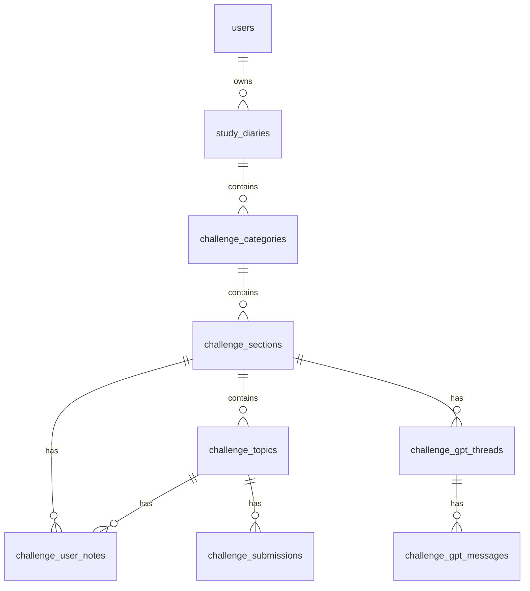

# 01. DB 설계 변경안

## 핵심 모델

스터디 다이어리의 ownership은 category 단위가 아니라 diary 단위로 잡는다.



## 신규 테이블

`study_diaries`

```ts
export const studyDiariesTable = sqliteTable('study_diaries', {
  id: text('id').primaryKey(),
  userId: text('user_id')
    .notNull()
    .references(() => usersTable.id, { onDelete: 'cascade' }),
  title: text('title').notNull(),
  description: text('description'),
  visibility: text('visibility').$type<'private' | 'shared' | 'public'>().notNull().default('private'),
  createdAt: text('created_at').notNull(),
  updatedAt: text('updated_at').notNull(),
});
```

SQLite DDL:

```sql
CREATE TABLE IF NOT EXISTS study_diaries (
  id TEXT PRIMARY KEY,
  user_id TEXT NOT NULL,
  title TEXT NOT NULL,
  description TEXT,
  visibility TEXT NOT NULL DEFAULT 'private',
  created_at TEXT NOT NULL,
  updated_at TEXT NOT NULL,
  FOREIGN KEY(user_id) REFERENCES users(id) ON DELETE CASCADE
);

CREATE UNIQUE INDEX IF NOT EXISTS idx_study_diaries_user
  ON study_diaries(user_id);
```

2차 MVP에서는 사용자당 다이어리 1개만 허용한다. 나중에 다이어리 여러 개를 허용하려면 unique index를 제거하고 `is_default` 또는 `slug`를 추가한다.

## 기존 테이블 변경

`challenge_categories`에 `diary_id`를 추가한다.

```ts
diaryId: text('diary_id')
  .notNull()
  .references(() => studyDiariesTable.id, { onDelete: 'cascade' }),
```

SQLite 마이그레이션에서는 바로 `NOT NULL`을 붙이기 어렵다. 안전한 순서는 아래와 같다.

1. nullable `diary_id` 컬럼 추가
2. 기존 사용자별 `study_diaries` 생성
3. 기존 category에 `diary_id` backfill
4. 애플리케이션 레벨에서 `diary_id` 필수로 검증
5. SQLite 테이블 재작성까지 할 때만 `NOT NULL` 제약을 물리적으로 강제

권장 index:

```sql
CREATE INDEX IF NOT EXISTS idx_challenge_categories_diary
  ON challenge_categories(diary_id, order_idx);
```

## 왜 category.created_by만으로 끝내지 않나

`challenge_categories.created_by`를 owner로 재사용하는 최소 변경도 가능하다. 하지만 다음 이유로 `study_diaries` 루트가 더 낫다.

- `{사용자명}의 스터디 다이어리` 같은 제목/설명/공개 상태를 저장할 곳이 생긴다.
- 사용자별 최초 진입 생성 로직이 명확해진다.
- 추후 템플릿 복사, 다이어리 공유, 공개 페이지를 만들 때 구조가 덜 흔들린다.
- category 작성자와 diary 소유자를 분리할 수 있다. 예를 들어 관리자가 템플릿을 복사해줘도 diary owner는 일반 유저가 된다.

## ownership 규칙

2차 MVP의 권한 기준은 단순하게 유지한다.

- diary owner만 category/section/topic/note를 읽고 수정할 수 있다.
- `visibility = shared/public`은 노트 공유 목록에서만 예외적으로 사용한다.
- admin도 운영 도구가 아니라면 기본 사용자 화면에서는 자기 다이어리만 본다.
- admin 전용 전체 조회가 필요하면 `/admin/study-diaries` 같은 별도 API로 분리한다.

## 데이터 무결성 규칙

서비스 레이어에서 반드시 검사한다.

- category 접근 전: `category.diaryId`가 현재 유저의 diary id인지 확인
- section 접근 전: section -> category -> diary owner 확인
- topic 접근 전: topic -> section -> category -> diary owner 확인
- note 접근 전: note.userId가 현재 유저인지 확인하고, section/topic도 같은 diary 안인지 확인
- submission 접근 전: submission.userId가 현재 유저이거나 admin인지 확인하고, topic도 같은 diary 안인지 확인
- gpt thread 접근 전: thread.userId가 현재 유저인지 확인하고, section도 같은 diary 안인지 확인

## 명명 정책

장기적으로는 `challenge_*` 이름을 `study_diary_*`로 바꾸는 것이 깔끔하다. 하지만 2차 MVP에서는 테이블 rename까지 하면 마이그레이션 리스크가 커진다.

권장 순서:

1. 2차 MVP: `study_diaries`만 추가하고 기존 `challenge_*` 테이블 재사용
2. 안정화 후: API/프론트 namespace를 `study-diary`로 분리
3. 이후 필요하면 테이블 rename 계획 별도 수립
