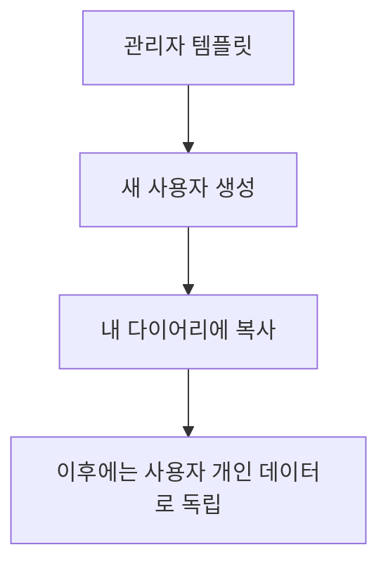

# 04. 마이그레이션과 seed 정책

## 목표

기존 `challenge_*` 데이터를 잃지 않고, 새 개인 다이어리 구조로 옮긴다.

## 마이그레이션 순서

1. `study_diaries` 테이블 생성
2. 기존 모든 user에 대해 diary 생성
3. `challenge_categories`에 `diary_id` nullable 컬럼 추가
4. 기존 category를 적절한 diary에 연결
5. 신규 생성 로직은 항상 `diary_id`를 채우도록 변경
6. 운영 안정화 후 필요하면 SQLite 테이블 재작성으로 `diary_id NOT NULL` 강제

## 기존 category backfill 정책

권장 1차 정책:

- `challenge_categories.created_by`가 있는 경우 해당 user의 diary에 연결한다.
- `created_by` user가 없거나 깨져 있으면 seed/admin user의 diary에 연결한다.

SQL 개념:

```sql
UPDATE challenge_categories
SET diary_id = (
  SELECT id
  FROM study_diaries
  WHERE study_diaries.user_id = challenge_categories.created_by
  LIMIT 1
)
WHERE diary_id IS NULL;
```

## 새 사용자 정책

새 사용자가 `/study-diary`에 처음 들어오면 서버가 diary를 자동 생성한다.

기본 title:

```txt
{user.name}의 스터디 다이어리
```

기본 category 정책은 두 가지 중 하나를 선택한다.

### 옵션 A: 빈 다이어리로 시작

장점:

- 개인화 의미가 명확하다.
- 불필요한 seed 데이터가 사용자에게 강제로 들어가지 않는다.
- 구현이 단순하다.

단점:

- 첫 화면이 비어 보인다.

### 옵션 B: 기본 템플릿 복사

장점:

- 새 사용자가 바로 예시를 볼 수 있다.
- 학습 플로우를 안내하기 쉽다.

단점:

- 템플릿 원본과 사용자 복사본을 구분해야 한다.
- 나중에 템플릿 업데이트를 사용자 데이터에 어떻게 반영할지 정책이 필요하다.

2차 MVP 권장안은 옵션 A다. 현재 화면에는 추가 버튼이 이미 있으므로 빈 다이어리로 시작해도 기능 검증이 가능하다. 템플릿 복사는 별도 MVP로 분리하는 편이 안전하다.

## 기존 seed 데이터

현재 보이는 `Spring Boot3`, `websocket` 같은 데이터는 기존 seed user 또는 생성자의 diary에 귀속시킨다. 모든 사용자에게 자동 복제하지 않는다.

필요하면 추후 `study_diary_templates`를 추가한다.



## 롤백 고려

2차 MVP 변경은 기존 테이블 삭제 없이 additive하게 진행한다.

- 새 테이블 추가
- 기존 테이블 컬럼 추가
- 기존 API 유지
- 새 `/study-diary/*` API 추가

문제가 생기면 프론트만 기존 `ChallengePage` 사용으로 되돌릴 수 있다. 단, 되돌리더라도 새로 생긴 `study_diaries`와 `diary_id` 컬럼은 DB에 남겨둔다.

## 데이터 검증 쿼리

diary 없는 category 확인:

```sql
SELECT id, name, created_by
FROM challenge_categories
WHERE diary_id IS NULL;
```

user별 diary 수 확인:

```sql
SELECT user_id, COUNT(*) AS diary_count
FROM study_diaries
GROUP BY user_id;
```

다른 사용자 diary에 잘못 연결된 section/topic은 category를 기준으로 검증한다. section/topic에는 직접 owner가 없으므로 category join으로 확인한다.
