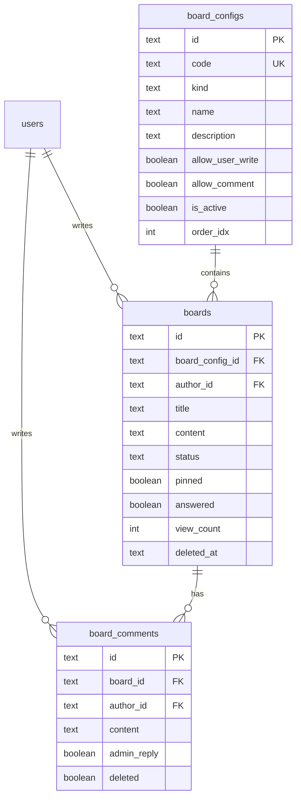

# 00. 개요 / 결정사항

## 핵심 결정

RestaurantBook처럼 게시판 자체를 추가하는 구조로 간다.



## MVP 범위

### 포함

- 관리자 게시판 설정 CRUD
- 관리자 게시글 관리
- 사용자 게시판 목록/상세/작성
- 문의 게시판 관리자 답변
- 공지사항 관리자 작성
- 게시판 활성/비활성
- 핀 고정
- 미답변 문의 카운트

### 제외

- 첨부파일 연결
- 대댓글
- 좋아요
- 실시간 알림/WebSocket
- 공개 비로그인 문의
- 전문 검색
- 게시글 본문 Lexical JSON 전환

## 기본 정책

| 게시판 | code | kind | 사용자 작성 | 댓글/답변 | 기본 활성 |
|---|---|---|---:|---:|---:|
| 공지사항 | `notice` | `NOTICE` | 차단 | 차단 | 활성 |
| 문의 게시판 | `inquiry` | `INQUIRY` | 허용 | 허용 | 활성 |

## 권한 정책

- 목록/상세 조회: 로그인 사용자
- 사용자 작성: `board_configs.allow_user_write = true`
- 사용자 수정/삭제: 작성자 본인 또는 관리자
- 관리자 설정/게시글 관리: `role === 'admin'`
- `code`와 `boardId`가 일치하지 않으면 404로 처리한다.

## URL 정책

사용자:

```txt
GET    /api/boards/configs
GET    /api/boards/:code
GET    /api/boards/:code/:boardId
POST   /api/boards/:code
PATCH  /api/boards/:code/:boardId
DELETE /api/boards/:code/:boardId
GET    /api/boards/:code/:boardId/comments
POST   /api/boards/:code/:boardId/comments
```

관리자:

```txt
GET    /api/admin/board-configs
POST   /api/admin/board-configs
PATCH  /api/admin/board-configs/:code
DELETE /api/admin/board-configs/:code

GET    /api/admin/boards/:code
POST   /api/admin/boards/:code
PATCH  /api/admin/boards/:code/:boardId
DELETE /api/admin/boards/:code/:boardId
PATCH  /api/admin/boards/:code/:boardId/pin
PATCH  /api/admin/boards/:code/:boardId/unpin
PATCH  /api/admin/boards/:code/:boardId/status
POST   /api/admin/boards/:code/:boardId/replies
GET    /api/admin/boards/inquiries/unanswered-count
```

## 현재 프로젝트에 맞춘 차이

- RestaurantBook은 Spring/JPA이고 이 프로젝트는 NestJS + Drizzle + SQLite다.
- 이 프로젝트는 `DatabaseService`에서 `CREATE TABLE IF NOT EXISTS`를 직접 관리하고, Drizzle migration도 같이 존재한다.
- 사용자 id는 `Long`이 아니라 `text UUID`다.
- role은 현재 `admin | user` 문자열이다.
- 프론트 라우팅은 Next App Router가 아니라 `@tanstack/react-router`다.
- 헤더 메뉴는 서버의 `menus` 테이블을 불러와 `AppHeader`에서 `sectionId`를 path로 매핑한다.
- 스타일은 AGENTS.md 규칙대로 semantic token 또는 `ui-*` 유틸만 쓴다.

