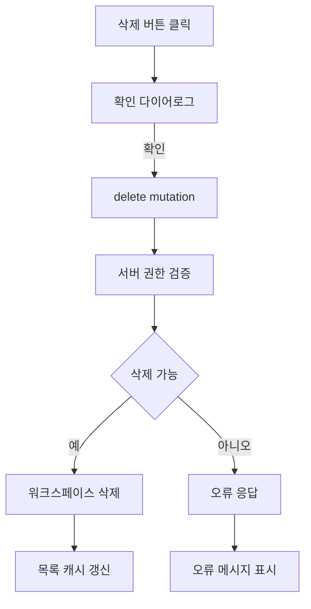

# 프로토타입 워크스페이스 삭제 기능 코드 리뷰

## 전체 요약

프로토타입 워크스페이스 삭제 기능은 카드 UI에서 삭제 액션을 시작하고, 확인 다이어로그를 거쳐 서버 삭제 API를 호출한 뒤 목록 캐시를 갱신하는 흐름이다. 핵심 검토 포인트는 삭제 권한, 연관 데이터 처리, 실패 시 복구 가능한 UI 상태, 캐시 무효화 범위다.

## 변경 파일

```txt
.
├── towercrane-for-uiux-front
│   └── src
│       ├── pages
│       │   └── prototype-workspace
│       │       └── ui
│       │           └── prototype-workspace-home-page.tsx
│       └── entities
│           └── prototype-workspace
│               └── api
│                   └── prototype-workspace-api.ts
└── towercrane-for-uiux-server
    └── src
        └── prototype-workspaces
            ├── prototype-workspaces.controller.ts
            └── prototype-workspaces.service.ts
```

권장: 프론트 카드 액션, API 훅, 서버 controller/service가 하나의 삭제 흐름으로 연결되어 있는지 확인한다.

## 주요 프로세스

1. 사용자가 워크스페이스 카드의 삭제 버튼을 누른다.
2. 삭제 확인 다이어로그가 열린다.
3. 사용자가 확인하면 delete mutation이 실행된다.
4. 서버는 사용자 권한과 워크스페이스 존재 여부를 검증한다.
5. 삭제가 성공하면 프론트는 워크스페이스 목록 쿼리를 무효화한다.
6. 실패하면 다이어로그 또는 toast로 오류를 보여준다.

권장: 삭제 성공 후 다이어로그 닫기, 목록 갱신, 오류 표시 책임이 한 곳에 과하게 섞이지 않았는지 확인한다.

## 주요 로직

#### 단계 1. 삭제 버튼 노출 조건 (함수 컴포넌트: PrototypeWorkspaceCard)

```tsx
// 소유자 또는 관리자에게만 삭제 액션을 노출
const canManage = workspace.role === 'owner' || session.user?.role === 'ADMIN'

return canManage ? (
  <DeleteWorkspaceDialog workspace={workspace} />
) : null
```

워크스페이스 카드에서 삭제 액션의 진입점을 제어하는 로직이다. 권한 없는 사용자는 UI에서 삭제 액션을 시작할 수 없어야 한다.

→ UI 권한 조건과 서버 권한 조건이 같은 정책을 바라보도록 역할 상수를 공유하거나 응답 필드로 `canDelete`를 내려주는 방식이 좋다.

---

#### 단계 2. 삭제 확인과 mutation 실행 (함수 컴포넌트: DeleteWorkspaceDialog)

```tsx
// 사용자가 확인한 경우에만 삭제 요청을 보낸다
await deleteWorkspaceMutation.mutateAsync(workspace.id)
setOpen(false)
```

삭제 확인 다이어로그에서 사용자 확인 이후에만 서버 요청을 실행하는 단계다. 삭제 대상 이름을 보여주면 실수 삭제를 줄일 수 있다.

→ 실패 시 다이어로그를 닫지 않고 오류 메시지를 유지하면 사용자가 상태를 이해하기 쉽다.

---

#### 단계 3. 서버 삭제 요청과 목록 갱신 (API 훅: useDeletePrototypeWorkspace)

```ts
// 삭제 성공 후 워크스페이스 목록을 다시 불러온다
return useMutation({
  mutationFn: (workspaceId: string) => deletePrototypeWorkspace(workspaceId),
  onSuccess: () => queryClient.invalidateQueries({ queryKey: prototypeWorkspaceKeys.lists() }),
})
```

삭제 API 호출과 성공 후 목록 갱신을 연결하는 클라이언트 서버 상태 관리 로직이다.

→ 목록, 상세, 관련 카테고리 쿼리가 분리되어 있다면 성공 후 무효화 범위를 명시적으로 묶어야 한다.

---

#### 단계 4. 서버 권한 검증과 삭제 처리 (서비스 함수: deleteWorkspace)

```ts
// 존재 여부와 권한을 확인한 뒤 삭제한다
const workspace = this.ensureWorkspace(workspaceId)
this.ensureCanDelete(user, workspace)
this.db.delete(prototypeWorkspacesTable).where(eq(prototypeWorkspacesTable.id, workspaceId)).run()
```

서버가 최종 삭제 권한과 워크스페이스 존재 여부를 검증하는 핵심 단계다. UI 권한 체크가 있어도 서버 검증은 반드시 필요하다.

→ 연관 카테고리/프로토타입이 있으면 물리 삭제, cascade, soft delete 중 어떤 정책인지 service 계층에서 명확히 드러내야 한다.

## 핵심 문법

문법 1. TanStack Query mutation

```ts
const deleteWorkspaceMutation = useMutation({
  mutationFn: deletePrototypeWorkspace,
  onSuccess: () => queryClient.invalidateQueries({ queryKey: prototypeWorkspaceKeys.lists() }),
})
```

보충 설명: 삭제 요청은 서버 상태 변경이므로 mutation으로 다루고, 성공 후 목록 쿼리를 무효화해 화면과 서버 상태를 다시 맞춘다. 이 패턴이 빠지면 삭제는 성공했는데 카드가 화면에 남아 있는 문제가 생길 수 있다.

## 아키텍처/클린코드

삭제 흐름은 카드 UI, 확인 다이어로그, API 훅, 서버 service로 책임을 나누는 것이 좋다. 카드 컴포넌트가 권한 판단, 다이어로그 상태, API 호출, 오류 표시를 모두 직접 처리하면 파일이 빠르게 커지므로 삭제 전용 다이어로그 또는 feature 컴포넌트로 분리하는 편이 유지보수에 유리하다.

## 검증

- 삭제 확인 다이어로그에서 취소하면 API가 호출되지 않아야 한다.
- 삭제 성공 후 목록에서 카드가 사라져야 한다.
- 삭제 실패 시 기존 카드가 유지되어야 한다.
- 권한 없는 사용자는 삭제할 수 없어야 한다.
- 연관 카테고리/프로토타입이 있는 워크스페이스 삭제 정책을 확인해야 한다.

## 리스크

삭제 API가 물리 삭제를 수행한다면 복구가 어렵다. 운영 데이터가 포함될 가능성이 있으면 보관 처리 또는 soft delete 정책을 먼저 검토하는 것이 안전하다.

권장: MVP 단계에서는 삭제 확인 문구에 워크스페이스 이름을 포함하고, 서버에서는 권한 검증을 반드시 수행한다.

## MMD


