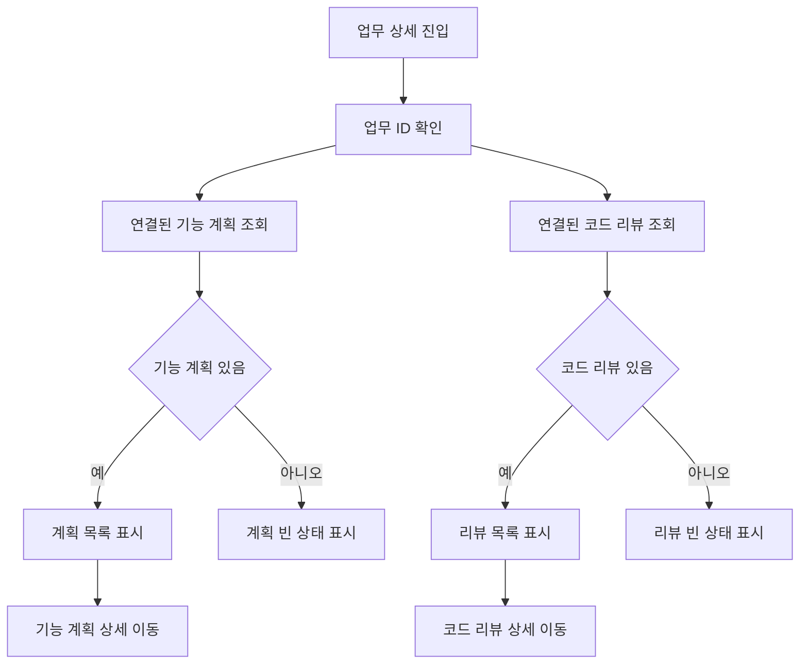

# 업무 상세에서 연결된 기능 계획과 코드 리뷰 보기 구현

## 업무 배경

기능 개발 계획과 코드 리뷰 게시판은 별도 화면으로 동작하지만, 실제 업무를 볼 때는 해당 업무와 연결된 계획/리뷰 산출물을 한 번에 확인하는 흐름이 더 자연스럽다. 현재는 업무 ID를 복사하거나 별도 게시판에서 검색해야 해서 작업 이력이 흩어진다. 업무 상세 화면에 연결된 기능 계획과 코드 리뷰를 모아 보여주면 PMS가 단순 업무 목록이 아니라 개발 히스토리 허브처럼 작동한다.

## 완료 기준

- 업무 상세 화면에서 해당 업무와 연결된 기능 개발 계획 목록이 보인다.
- 업무 상세 화면에서 해당 업무와 연결된 코드 리뷰 목록이 보인다.
- 각 항목은 제목, 요약, 생성일, 작성자, 위험도 또는 상태 정보를 간단히 보여준다.
- 항목 클릭 또는 열기 버튼으로 원본 기능 계획/코드 리뷰 상세 화면으로 이동한다.
- 연결된 산출물이 없을 때 빈 상태 UI가 보인다.
- 기존 업무 기본 정보, 체크리스트, 첨부 영역의 레이아웃이 깨지지 않는다.

## 단계별 계획

1. 현재 업무 상세 페이지의 데이터 로딩 구조와 섹션 배치를 확인한다.
2. 기능 계획과 코드 리뷰의 업무 연결 필드 및 목록 API를 확인한다.
3. 업무 ID 기준 기능 계획 목록 조회 API를 추가하거나 기존 목록 API 필터를 확장한다.
4. 업무 ID 기준 코드 리뷰 목록 조회 API를 추가하거나 기존 목록 API 필터를 확장한다.
5. 프론트 엔티티 API에 linkedTaskId 기반 조회 훅을 추가한다.
6. 업무 상세 화면에 개발 산출물 섹션을 추가하고 계획/리뷰를 탭 또는 2열 목록으로 배치한다.
7. 항목별 원본 상세 이동 버튼과 빈 상태 UI를 구현한다.
8. 로컬에서 업무 상세 진입, 연결 산출물 노출, 원본 이동, 빈 상태를 검증한다.

## 예상 파일 구조

```txt
.
├── towercrane-for-uiux-front
│   └── src
│       ├── pages
│       │   └── task
│       │       └── ui
│       │           └── task-detail-page.tsx
│       └── entities
│           ├── feature-plan
│           │   └── api
│           │       └── feature-plan-api.ts
│           └── code-review
│               └── api
│                   └── code-review-api.ts
└── towercrane-for-uiux-server
    └── src
        ├── feature-plans
        │   ├── feature-plans.controller.ts
        │   ├── feature-plans.schemas.ts
        │   └── feature-plans.service.ts
        └── code-reviews
            ├── code-reviews.controller.ts
            ├── code-reviews.schemas.ts
            └── code-reviews.service.ts
```

## 체크리스트

- 업무 상세 데이터 구조 확인
- 기능 계획 linkedTaskId 조회 방식 확정
- 코드 리뷰 taskId 조회 방식 확정
- 서버 목록 필터 확장
- 프론트 API 훅 추가
- 업무 상세 개발 산출물 섹션 구현
- 원본 상세 이동 연결
- 빈 상태 UI 구현
- 로컬 타입체크와 빌드 검증

## MMD


