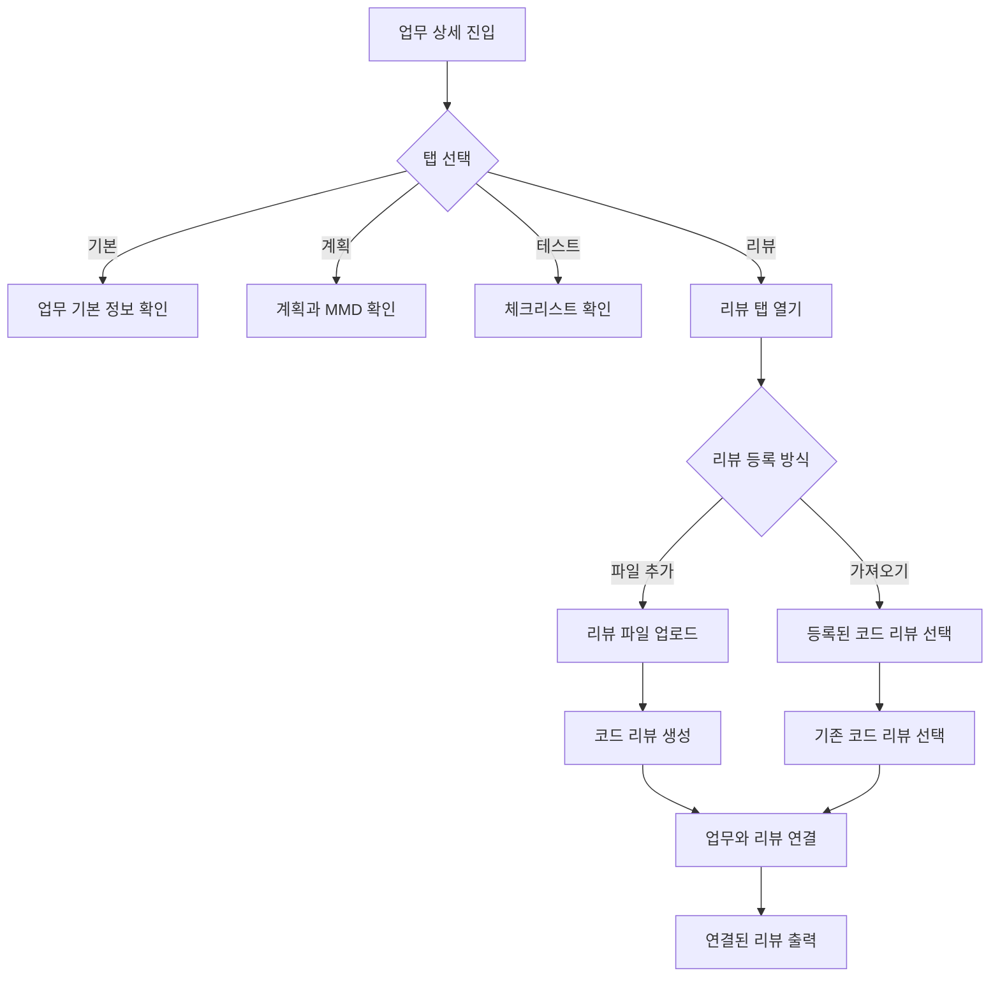

# 업무 상세에서 특정 코드 리뷰 연동하기 구현 계획

## 전체 요약

업무 상세 화면에서 기본 정보, 계획, 테스트, 리뷰를 탭으로 나누고, 리뷰 탭에서 코드 리뷰 파일을 직접 등록하거나 이미 등록된 코드 리뷰를 가져와 업무와 연결한다.
업무 목록의 행 액션은 상세 진입만 남기고, 계획과 리뷰는 상세 화면 안에서 확인하도록 정리한다.

## 내용

기존 흐름은 업무 목록에서 별도 리뷰 버튼을 눌러 안내 다이어로그를 열고, 사용자가 업무 ID와 스킬 명령을 복사하는 방식에 가까웠다.
이 방식은 실제로 코드 리뷰가 이미 등록되어 있을 때도 연결까지 단계가 많고, 업무 상세 정보와 리뷰 내용을 한 화면에서 보기 어렵다.
업무 상세를 `기본`, `계획`, `테스트`, `리뷰` 탭으로 분리하고 리뷰 탭에서 `리뷰 파일 추가`와 `코드 리뷰 가져오기`를 제공하면 더 직관적이다.

## 완료 기준

- 업무 상세 화면에 `기본`, `계획`, `테스트`, `리뷰` 탭이 보인다.
- 기본 탭에는 제목, 내용, 유형, 상태, 우선순위, 담당자, 마감일, 첨부, 댓글이 표시된다.
- 계획 탭에는 단계별 계획, 예상 파일 구조, MMD가 표시된다.
- 테스트 탭에는 체크리스트가 표시된다.
- 리뷰 탭에는 `리뷰 파일 추가`와 `코드 리뷰 가져오기` 버튼이 보인다.
- 리뷰 파일을 업로드하면 코드 리뷰가 생성되고 현재 업무와 연결된다.
- `코드 리뷰 가져오기`로 이미 등록된 리뷰를 선택하면 현재 업무와 연결된다.
- 연결된 리뷰가 있으면 리뷰 요약, 검토 항목, MMD/다이어그램 항목이 업무 상세에 표시된다.
- 업무 목록 행 액션에는 `상세`만 남고, 계획/리뷰 버튼은 제거된다.

## 단계별 계획

1. 현재 업무 상세 컴포넌트와 코드 리뷰 API 구조를 확인한다.
2. 업무 상세 화면을 기본, 계획, 테스트, 리뷰 탭 구조로 정리한다.
3. 기본 탭에는 업무 기본 정보와 첨부/댓글만 배치한다.
4. 계획 탭에는 단계별 계획, 예상 파일 구조, MMD 패널을 배치한다.
5. 테스트 탭에는 기존 체크리스트 영역을 이동한다.
6. 리뷰 탭에 리뷰 파일 업로드 버튼과 코드 리뷰 가져오기 버튼을 추가한다.
7. 리뷰 파일 업로드 시 마크다운을 코드 리뷰 payload로 변환하고 현재 업무 ID와 연결한다.
8. 코드 리뷰 선택 다이어로그에서 리뷰를 선택하면 현재 업무와 연결한다.
9. 연결된 리뷰 상세를 마크다운/검토 항목/MMD 형태로 출력한다.
10. 업무 목록 테이블 행 액션에서 계획/리뷰 버튼을 제거하고 상세 버튼만 남긴다.
11. 빈 상태, 로딩, 업로드 실패, 연결 실패 상태를 검증한다.
12. 로컬 lint, typecheck, build를 실행한다.

## 예상 파일 구조

```txt
.
├── towercrane-for-uiux-front
│   └── src
│       ├── pages
│       │   └── task
│       │       └── ui
│       │           ├── task-detail-page.tsx
│       │           └── task-page.tsx
│       ├── features
│       │   └── task
│       │       └── ui
│       │           ├── task-attachments-panel.tsx
│       │           ├── task-comments-panel.tsx
│       │           ├── task-table-view.tsx
│       │           └── task-toolbar.tsx
│       └── entities
│           ├── task
│           │   └── api
│           │       └── task-api.ts
│           └── code-review
│               └── api
│                   └── code-review-api.ts
└── towercrane-for-uiux-server
    └── src
        └── code-reviews
            ├── code-reviews.controller.ts
            ├── code-reviews.schemas.ts
            └── code-reviews.service.ts
```

## 체크리스트

- 업무 상세 탭 구조 확인
- 기본/계획/테스트/리뷰 영역 분리
- 리뷰 파일 업로드 연결
- 코드 리뷰 가져오기 다이어로그 구현
- 업무-리뷰 연결 mutation 확인
- 연결된 리뷰 상세 출력
- 업무 목록 행 액션 정리
- 빈 상태와 오류 상태 처리
- 로컬 lint
- 로컬 typecheck
- 프론트 build

## MMD


