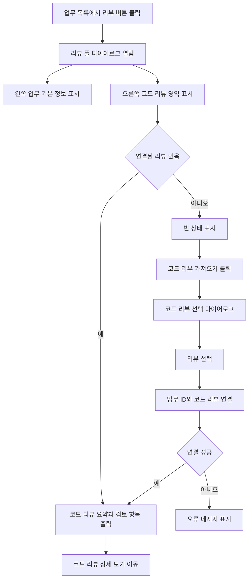

# 업무 상세에서 특정 코드 리뷰 연동하기 구현

## 업무 배경

현재 업무 리뷰 다이어로그는 업무 ID 복사와 스킬 발동 예시를 중심으로 구성되어 있어 실제 사용자가 등록된 코드 리뷰를 업무와 연결하기까지 단계가 많다. 코드 리뷰 게시판에 이미 리뷰가 등록되어 있다면, 업무 상세에서 해당 리뷰를 직접 선택하고 바로 연결하는 흐름이 더 직관적이다. 다이어로그는 안내 문구를 줄이고, 왼쪽에는 업무 기본 정보만, 오른쪽에는 연결된 코드 리뷰 또는 리뷰 선택 UI를 배치하는 편이 좋다.

## 완료 기준

- 업무 목록의 `리뷰` 버튼을 누르면 풀 다이어로그가 열린다.
- 다이어로그 왼쪽에는 업무 기본 정보만 표시된다.
- 기존 스킬 발동 예시, 문의 안내, 복잡한 설명 영역은 제거된다.
- 다이어로그 오른쪽 상단에 `코드 리뷰 가져오기` 버튼이 보인다.
- `코드 리뷰 가져오기`를 누르면 등록된 코드 리뷰를 선택할 수 있는 목록/검색 다이어로그가 열린다.
- 코드 리뷰를 선택하면 해당 리뷰가 현재 업무와 연결된다.
- 연결된 코드 리뷰가 있으면 오른쪽 영역에 코드 리뷰 요약과 검토 항목이 출력된다.
- 연결된 코드 리뷰의 `원본 보기` 또는 `상세 보기`로 코드 리뷰 상세 페이지에 이동할 수 있다.
- 연결된 리뷰가 없을 때는 빈 상태 UI만 간단히 표시된다.

## 단계별 계획

1. 현재 업무 목록의 `리뷰` 버튼과 리뷰 다이어로그 컴포넌트 위치를 확인한다.
2. 리뷰 다이어로그에서 스킬 발동 예시/문의 안내/불필요한 설명 영역을 제거한다.
3. 왼쪽 패널을 업무 기본 정보 전용 카드로 정리한다.
4. 코드 리뷰 목록 API가 task 연결 여부와 검색 조건을 지원하는지 확인한다.
5. 필요하면 코드 리뷰와 업무를 연결하는 API를 추가하거나 기존 연결 API를 재사용한다.
6. 오른쪽 상단에 `코드 리뷰 가져오기` 버튼을 추가한다.
7. 코드 리뷰 선택 다이어로그를 만들고 제목, 요약, 위험도, 생성일 기준으로 리뷰를 고르게 한다.
8. 선택한 코드 리뷰를 현재 업무 ID와 연결한 뒤 오른쪽 패널을 갱신한다.
9. 오른쪽 패널에 연결된 코드 리뷰 요약, 변경 파일, 주요 프로세스, 주요 로직 일부를 읽기 좋게 출력한다.
10. 연결 없음, 연결 성공, 연결 실패, 권한 없음 상태를 로컬에서 검증한다.

## 예상 파일 구조

```txt
.
├── towercrane-for-uiux-front
│   └── src
│       ├── pages
│       │   └── task
│       │       └── ui
│       │           └── task-workspace-page.tsx
│       ├── features
│       │   └── task-code-review
│       │       └── ui
│       │           ├── task-code-review-dialog.tsx
│       │           └── code-review-picker-dialog.tsx
│       └── entities
│           ├── task
│           │   └── api
│           │       └── task-api.ts
│           └── code-review
│               └── api
│                   └── code-review-api.ts
└── towercrane-for-uiux-server
    └── src
        └── code-reviews
            ├── code-reviews.controller.ts
            ├── code-reviews.schemas.ts
            └── code-reviews.service.ts
```

## 체크리스트

- 현재 리뷰 다이어로그 컴포넌트 확인
- 불필요한 스킬 안내 영역 제거
- 업무 기본 정보 패널 정리
- 코드 리뷰 목록 검색/선택 UI 구현
- 코드 리뷰 업무 연결 API 확인 또는 추가
- 연결된 코드 리뷰 조회 흐름 구현
- 오른쪽 코드 리뷰 출력 패널 구현
- 원본/상세 보기 이동 연결
- 빈 상태와 오류 상태 처리
- 로컬 타입체크와 빌드 검증

## MMD


