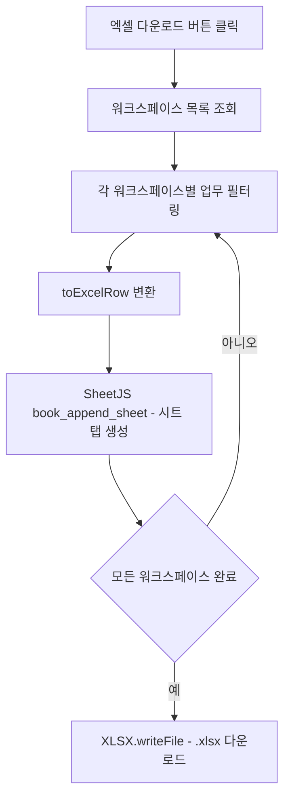

# 업무 테이블 액션 버튼 가로 배치 및 워크스페이스별 엑셀 다운로드 구현

## 내용

업무 테이블의 액션 영역(상세 보기, 링크 이동)이 좁은 컬럼 폭 때문에 텍스트가 세로로 깨지는 문제를 해결한다.
버튼을 가로로 정렬하거나 버튼 두 개를 위아래로 배치해 가독성을 확보한다.

아울러, 업무 목록을 워크스페이스별 시트 탭으로 구분해 엑셀 파일(.xlsx)로 내보내는 기능을 추가한다.
라이브러리는 SheetJS(`xlsx`)를 사용하며, 각 워크스페이스가 별도 시트 탭으로 나뉘고 필수 컬럼만 포함한다.

## 완료 기준

- 상세/링크 버튼 텍스트가 잘리거나 세로로 깨지지 않는다.
- 버튼 레이아웃 변경 후 다른 컬럼 폭에 영향을 주지 않는다.
- "엑셀 다운로드" 버튼 클릭 시 .xlsx 파일이 즉시 다운로드된다.
- 다운로드된 파일은 워크스페이스 수만큼 시트 탭을 가진다.
- 각 시트는 업무 ID·제목·유형·상태·우선순위·담당자·마감일·작성자·작성일·링크 컬럼을 포함한다.
- 한글 인코딩이 깨지지 않는다 (SheetJS .xlsx 포맷이 BOM 문제 없이 처리).
- macOS Numbers, Google Sheets에서도 정상적으로 열린다.

## 단계별 계획

1. `task-table-view.tsx` 액션 컬럼 구조를 확인하고 버튼 레이아웃(가로/위아래) 방향을 결정한다.
2. 액션 컬럼 minWidth와 버튼 flex 방향을 조정해 텍스트 깨짐을 수정한다.
3. `xlsx` 패키지를 프론트엔드 의존성에 추가한다.
4. 워크스페이스 목록과 각 워크스페이스별 업무 데이터를 조회하는 방법을 확인한다.
5. 엑셀 행 변환 헬퍼(`toExcelRow`)와 워크북 생성 함수(`buildWorkbook`)를 작성한다.
6. 업무 페이지 또는 테이블 뷰 상단에 "엑셀 다운로드" 버튼을 추가하고 함수를 연결한다.
7. 로컬에서 다운로드 결과를 Excel·Numbers·Google Sheets로 검증한다.

## 예상 파일 구조

```txt
.
└── towercrane-for-uiux-front
    └── src
        ├── features
        │   └── task
        │       ├── ui
        │       │   └── task-table-view.tsx          # 액션 버튼 레이아웃 수정
        │       └── lib
        │           └── export-tasks-to-excel.ts     # SheetJS 워크북 생성 헬퍼
        └── pages
            └── task
                └── ui
                    └── task-page.tsx                # 엑셀 다운로드 버튼 추가
```

## 체크리스트

- 액션 컬럼 레이아웃 확인
- 버튼 텍스트 깨짐 수정 (가로 배치 또는 위아래 스택)
- `xlsx` 패키지 설치
- 업무·워크스페이스 데이터 조회 흐름 확인
- 엑셀 행 변환 헬퍼 작성
- 워크북 생성 함수 작성
- 엑셀 다운로드 버튼 UI 추가
- 한글 인코딩 검증
- 멀티 시트 탭 검증 (Excel, Numbers, Google Sheets)

## MMD


