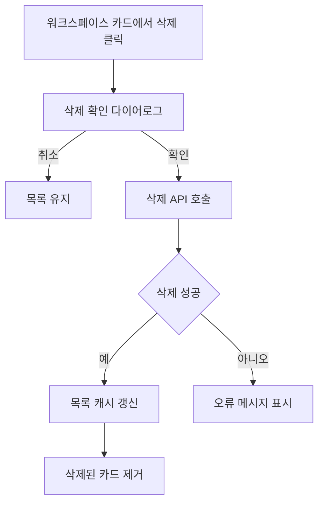

# 프로토타입 워크스페이스 삭제 기능 구현

## 업무 배경

프로토타입 관리 화면에서 워크스페이스 카드를 삭제할 수 있는 UI는 보이지만, 삭제 권한, 사용자 확인, 서버 삭제 요청, 목록 갱신 흐름이 실제 운영 수준으로 정리되어야 한다.

## 완료 기준

- 워크스페이스 카드에 삭제 버튼이 표시된다.
- 삭제 버튼 클릭 시 확인 다이어로그가 열린다.
- 확인 후 서버 삭제 API가 호출된다.
- 삭제 성공 시 목록 캐시가 갱신되고 카드가 화면에서 사라진다.
- 삭제 실패 시 사용자가 이해할 수 있는 오류 메시지를 보여준다.
- 권한이 없는 사용자는 삭제 버튼을 볼 수 없거나 서버에서 거절된다.

## 단계별 계획

1. 현재 프로토타입 워크스페이스 목록 페이지와 카드 컴포넌트 구조를 확인한다.
2. 삭제 버튼 노출 조건과 권한 필드를 확인한다.
3. 삭제 확인 다이어로그를 추가하고 삭제 대상 이름을 명확히 보여준다.
4. 프론트엔드 삭제 mutation과 React Query 캐시 갱신 흐름을 구현한다.
5. 서버의 프로토타입 워크스페이스 삭제 API, 서비스, 권한 검증을 확인한다.
6. 삭제 후 연관 카테고리/프로토타입 데이터 처리 정책을 확인한다.
7. 로컬에서 삭제 성공, 실패, 권한 없음 케이스를 검증한다.

## 예상 파일 구조

```txt
.
├── towercrane-for-uiux-front
│   └── src
│       ├── pages
│       │   └── prototype-workspace
│       │       └── ui
│       │           └── prototype-workspace-home-page.tsx
│       ├── entities
│       │   └── prototype-workspace
│       │       ├── api
│       │       │   └── prototype-workspace-api.ts
│       │       └── model
│       │           └── types.ts
│       └── features
│           └── prototype-workspace
│               └── delete-workspace
└── towercrane-for-uiux-server
    └── src
        └── prototype-workspaces
            ├── prototype-workspaces.controller.ts
            ├── prototype-workspaces.service.ts
            └── prototype-workspaces.schemas.ts
```

## 체크리스트

- 현재 UI 구조 확인
- 삭제 권한 조건 확인
- 삭제 확인 다이어로그 구현
- 삭제 API 연동
- 목록 갱신 처리
- 오류 메시지 처리
- 로컬 검증

## MMD


