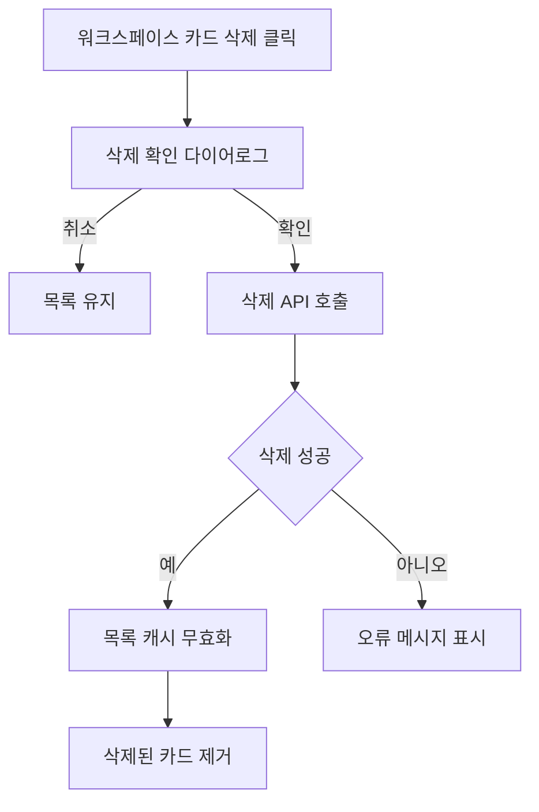

# 프로토타입 워크스페이스 삭제 기능 구현

## 내용

프로토타입 관리 화면에서 워크스페이스 카드를 삭제할 수 있는 기능을 운영 수준으로 정리한다.
사용자가 실수로 삭제하지 않도록 확인 다이어로그를 제공하고, 삭제 성공 후 목록 캐시가 갱신되어 화면에서 즉시 사라지게 만든다.
권한이 없는 사용자는 삭제 액션을 사용할 수 없거나 서버에서 명확히 거절되어야 한다.

## 완료 기준

- 권한 있는 사용자에게만 워크스페이스 삭제 버튼이 보인다.
- 삭제 버튼을 누르면 삭제 대상 이름이 포함된 확인 다이어로그가 열린다.
- 확인 시 서버 삭제 API가 호출된다.
- 삭제 성공 후 워크스페이스 목록이 갱신되고 삭제된 카드가 화면에서 사라진다.
- 삭제 실패 또는 권한 없음 상황에서 사용자가 이해할 수 있는 오류 메시지가 표시된다.
- 삭제 후 연관 카테고리와 프로토타입 데이터 처리 정책이 코드에서 일관되게 적용된다.

## 단계별 계획

1. 현재 프로토타입 워크스페이스 목록 페이지와 카드 컴포넌트 구조를 확인한다.
2. 워크스페이스 삭제 권한과 버튼 노출 조건을 정리한다.
3. 삭제 대상 이름을 보여주는 확인 다이어로그를 구현한다.
4. 프론트엔드 삭제 API 함수와 delete mutation을 연결한다.
5. 삭제 성공 시 React Query 워크스페이스 목록 캐시를 무효화한다.
6. 서버 삭제 controller/service와 권한 검증 흐름을 확인한다.
7. 삭제 후 연관 카테고리/프로토타입 데이터 처리 정책을 검증한다.
8. 성공, 실패, 권한 없음 케이스를 로컬에서 확인한다.

## 예상 파일 구조

```txt
.
├── towercrane-for-uiux-front
│   └── src
│       ├── pages
│       │   └── prototype-workspace
│       │       └── ui
│       │           └── prototype-workspace-home-page.tsx
│       └── entities
│           └── prototype-workspace
│               ├── api
│               │   └── prototype-workspace-api.ts
│               └── model
│                   └── types.ts
└── towercrane-for-uiux-server
    └── src
        └── prototype-workspaces
            ├── prototype-workspaces.controller.ts
            ├── prototype-workspaces.service.ts
            └── prototype-workspaces.schemas.ts
```

## 체크리스트

- 현재 UI 구조 확인
- 삭제 권한 조건 확인
- 삭제 확인 다이어로그 구현
- 삭제 API 연동
- 목록 캐시 갱신 처리
- 오류 메시지 처리
- 연관 데이터 처리 정책 확인
- 로컬 검증

## MMD


