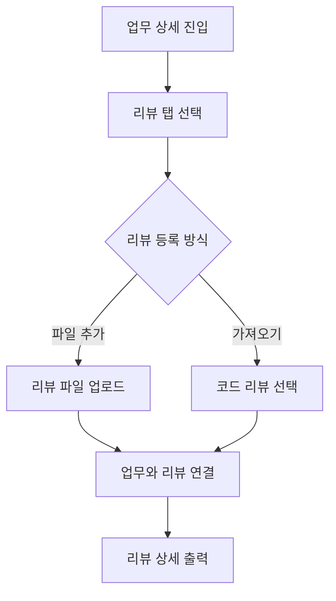

# 기능 개발 계획 형식

Towercrane `개발 도구 > 기능 개발 계획` 화면에 파일로 등록하기 위한 Markdown 형식입니다.
업무 등록 전 구현 범위, 계획, 예상 파일 구조, 검증 항목을 팀에서 먼저 공유할 때 사용합니다.

## 파일 이름

```txt
{기능명} 구현 계획.md
```

예:

```txt
업무 상세에서 특정 코드 리뷰 연동 하기 구현 계획.md
```

## Frontmatter

```md
---
title: 업무 상세에서 특정 코드 리뷰 연동하기
type: FEATURE
status: TODO
priority: MEDIUM
dueDate:
---
```

`기능 개발 계획` 게시판은 주로 `title`을 사용합니다. `type/status/priority/dueDate`는 이후 `PMS 업무 등록`으로 넘길 때 참고하기 좋습니다.

## 권장 섹션

업로드 파서는 `##` 또는 `###` 섹션 제목을 기준으로 내용을 나눕니다.

```md
# {기능명} 구현 계획

## 전체 요약

## 내용

## 완료 기준

## 단계별 계획

## 예상 파일 구조

## 체크리스트

## MMD
```

## 작성 예시

````md
---
title: 업무 상세에서 특정 코드 리뷰 연동하기
type: FEATURE
status: TODO
priority: MEDIUM
dueDate:
---

# 업무 상세에서 특정 코드 리뷰 연동하기 구현 계획

## 전체 요약

업무 상세 화면에서 업무 기본 정보와 연결된 코드 리뷰를 한 화면에서 확인할 수 있게 한다.
이미 등록된 코드 리뷰를 검색해서 업무와 연결하고, 연결된 리뷰의 요약과 검토 항목을 업무 상세에서 바로 볼 수 있게 만든다.

## 내용

현재 업무 상세의 리뷰 흐름은 리뷰 등록 안내와 코드 리뷰 확인 영역이 섞여 있어 실제 사용자가 이미 등록된 리뷰를 업무와 연결하기까지 단계가 많다.
업무 상세는 기본 정보, 계획, 테스트, 리뷰 탭으로 나누고 리뷰 탭에서는 파일 추가와 기존 리뷰 가져오기를 제공한다.

## 완료 기준

- 업무 상세에 기본, 계획, 테스트, 리뷰 탭이 보인다.
- 리뷰 탭 우상단에 리뷰 파일 추가와 코드 리뷰 가져오기 버튼이 보인다.
- 코드 리뷰를 선택하면 현재 업무와 연결된다.
- 연결된 코드 리뷰의 요약과 검토 항목이 업무 상세에 표시된다.
- 연결된 리뷰가 없을 때 빈 상태가 명확히 보인다.

## 단계별 계획

1. 현재 업무 상세 컴포넌트와 코드 리뷰 API 구조를 확인한다.
2. 업무 상세를 기본, 계획, 테스트, 리뷰 탭 구조로 정리한다.
3. 리뷰 탭에 리뷰 파일 업로드 버튼을 추가한다.
4. 코드 리뷰 목록 검색/선택 다이어로그를 구현한다.
5. 선택한 코드 리뷰를 현재 업무 ID와 연결한다.
6. 연결된 리뷰 상세를 업무 상세 리뷰 탭에 출력한다.
7. 빈 상태, 로딩, 연결 실패 상태를 검증한다.

## 예상 파일 구조

```txt
.
├── towercrane-for-uiux-front
│   └── src
│       ├── pages
│       │   └── task
│       │       └── ui
│       │           └── task-detail-page.tsx
│       ├── features
│       │   └── task
│       │       └── ui
│       │           ├── task-attachments-panel.tsx
│       │           └── task-comments-panel.tsx
│       └── entities
│           └── code-review
│               └── api
│                   └── code-review-api.ts
└── towercrane-for-uiux-server
    └── src
        └── code-reviews
            ├── code-reviews.controller.ts
            └── code-reviews.service.ts
```

## 체크리스트

- 현재 업무 상세 구조 확인
- 탭 구조 정리
- 리뷰 파일 업로드 연결
- 코드 리뷰 선택 다이어로그 구현
- 업무-리뷰 연결 mutation 확인
- 연결된 리뷰 상세 출력
- 로컬 타입체크
- 프론트 빌드

## MMD


````

## 섹션별 작성 규칙

- `전체 요약`: 목록 카드와 상세 요약에 보일 2~4문장
- `내용`: 왜 이 기능이 필요한지, 현재 UX나 개발 흐름의 불편
- `완료 기준`: 사용자 관점에서 검증 가능한 bullet 목록
- `단계별 계획`: 구현 순서대로 번호 목록
- `예상 파일 구조`: ```txt fenced code block의 폴더 구조
- `체크리스트`: 실행 가능한 작업 단위의 bullet 목록
- `MMD`: ```mermaid fenced code block, 첫 줄은 `flowchart TD`

## 업로드 방식

```txt
개발 도구 > 기능 개발 계획 > 계획 파일 업로드
```

업로드 후 계획 상세의 `PMS 업무 등록` 버튼을 누르면 같은 계획을 업무로도 등록할 수 있습니다.

## 파싱 주의사항

- 섹션 제목은 `## 내용`처럼 `##` 또는 `###`로 시작합니다.
- `예상 파일 구조`는 fenced code block 안에 넣어야 한 덩어리로 보입니다.
- `MMD`는 fenced code block 안에 넣어야 Mermaid 미리보기가 안정적입니다.
- `단계별 계획`은 번호 목록으로 작성합니다.
- `체크리스트`는 `-` bullet 목록으로 작성합니다.

## 금지

- 파일 구조를 한 줄 경로 목록으로 길게 나열하기
- `MMD` 섹션에 ```mermaid 없이 본문만 쓰기
- 단계별 계획을 한 문단으로 몰아서 쓰기
- 완료 기준과 체크리스트를 같은 섹션에 섞기
