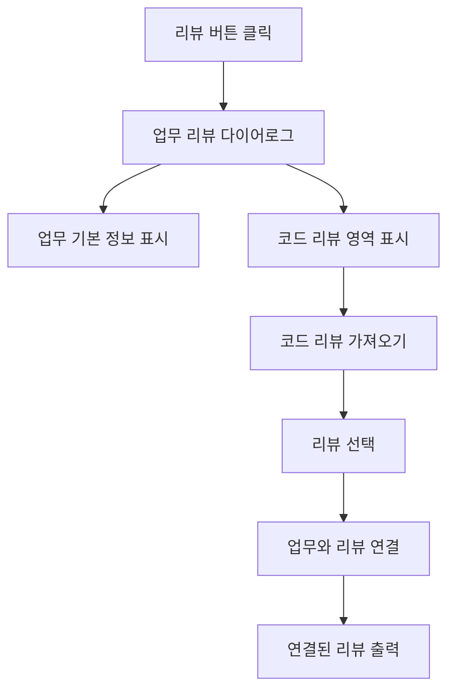

# 기능 개발 계획 형식

Codex가 기능 구현 전에 계획을 정리하고 Towercrane `기능 개발 계획` 게시판에 파일 업로드로 등록하기 위한 Markdown 형식입니다.

## 파일 이름 규칙

```txt
{기능명} 구현 계획.md
```

예:

```txt
업무 상세에서 특정 코드 리뷰 연동 하기 구현 계획.md
```

## Frontmatter

```md
---
title: 업무 상세에서 특정 코드 리뷰 연동하기
taskType: FEATURE
priority: MEDIUM
workspaceId: task-workspace-default
---
```

## 필수 섹션

아래 제목을 그대로 쓰는 것을 권장합니다. 업로드 파서는 `##` 또는 `###` 섹션 제목을 기준으로 내용을 나눕니다.

```md
# {기능명} 구현

## 업무 배경

## 완료 기준

## 단계별 계획

## 예상 파일 구조

## 체크리스트

## MMD
```

## 섹션별 작성 규칙

### 업무 배경

왜 이 기능을 만들지, 현재 UX나 개발 흐름에서 어떤 불편이 있는지 2~4문장으로 씁니다.

### 완료 기준

사용자 관점에서 완료 여부를 판단할 수 있는 결과를 bullet로 씁니다.

```md
- 업무 리뷰 다이어로그 왼쪽에는 업무 기본 정보만 표시된다.
- 오른쪽 상단에 코드 리뷰 가져오기 버튼이 보인다.
- 코드 리뷰를 선택하면 현재 업무와 연결된다.
- 연결된 코드 리뷰의 요약과 검토 항목이 오른쪽에 표시된다.
```

### 단계별 계획

구현 순서대로 번호 목록을 씁니다. 내부적으로는 step 1, step 2처럼 취급하기 쉬운 구조입니다.

```md
1. 현재 리뷰 다이어로그 컴포넌트와 코드 리뷰 API 구조를 확인한다.
2. 불필요한 스킬 발동 안내 영역을 제거한다.
3. 업무 기본 정보 패널을 왼쪽에 고정한다.
4. 코드 리뷰 목록 검색/선택 다이어로그를 구현한다.
5. 선택한 코드 리뷰를 업무 ID와 연결한다.
6. 연결된 리뷰 상세를 오른쪽에 출력한다.
7. 빈 상태, 로딩, 연결 실패 상태를 검증한다.
```

### 예상 파일 구조

반드시 fenced code block 안에 `txt`로 넣습니다. 이렇게 해야 전체 폴더 구조가 한 덩어리로 저장됩니다.

```txt
.
├── towercrane-for-uiux-front
│   └── src
│       ├── features
│       │   └── task
│       │       └── ui
│       │           └── task-table-view.tsx
│       └── entities
│           └── code-review
│               └── api
│                   └── code-review-api.ts
└── towercrane-for-uiux-server
    └── src
        └── code-reviews
            ├── code-reviews.controller.ts
            └── code-reviews.service.ts
```

### 체크리스트

실행 가능한 작업 단위로 짧게 씁니다.

```md
- 현재 리뷰 다이어로그 확인
- 코드 리뷰 연결 API 확인
- 코드 리뷰 선택 다이어로그 구현
- 업무 연결 mutation 구현
- 연결된 리뷰 상세 출력
- 로컬 타입체크
- 프론트 빌드
```

### MMD

반드시 fenced code block 안에 `mermaid`로 넣고, 첫 줄은 `flowchart TD`로 시작합니다.



## 업로드 방식

Towercrane의 `개발 도구 > 기능 개발 계획` 화면에서 `계획 파일 업로드` 버튼으로 이 형식의 `.md` 파일을 올립니다.

업로드 후 `PMS 업무 등록` 버튼을 누르면 같은 계획을 업무로도 등록할 수 있습니다.

## 파싱 주의사항

- 섹션 제목은 `## 업무 배경`처럼 `##` 또는 `###`로 시작합니다.
- `예상 파일 구조`는 ```txt fenced code block 안에 넣습니다.
- `MMD`는 ```mermaid fenced code block 안에 넣습니다.
- `단계별 계획`은 번호 목록으로 작성합니다.
- `체크리스트`는 `-` bullet 목록으로 작성합니다.

## 금지

- `MMD` 섹션에 ```mermaid 없이 Mermaid 본문만 쓰기
- 파일 구조를 한 줄 경로 목록으로 길게 나열하기
- 단계별 계획을 한 문단으로 몰아서 쓰기
- 완료 기준과 체크리스트를 같은 섹션에 섞기
