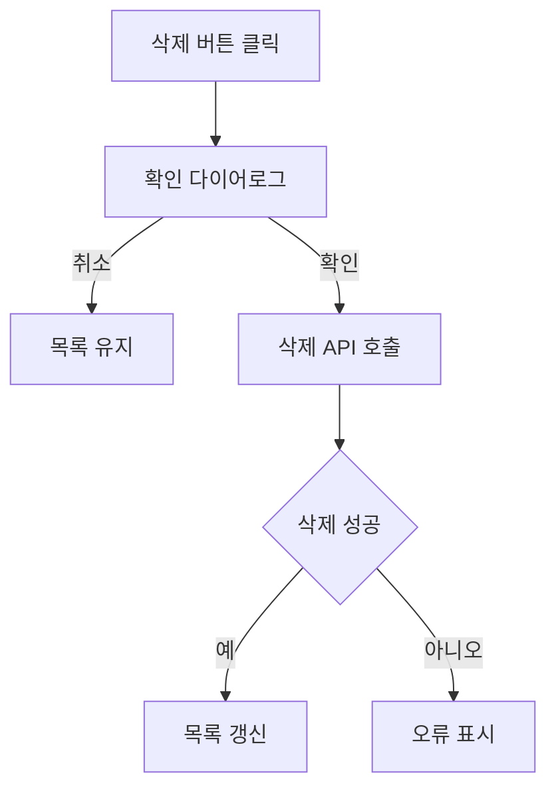

# 업무 등록 형식

Towercrane 업무 목록의 `파일로 등록` 버튼 또는 Codex `pms-task-register` 스킬로 PMS 업무를 만들 때 쓰는 Markdown 형식입니다.

## 파일 이름

```txt
{기능명}에 대한 업무 등록.md
```

예:

```txt
프로토 타입 워크 스페이스 삭제에 대한 업무 등록.md
```

## Frontmatter

파일 맨 위에 선택적으로 넣습니다. 업무 목록의 `파일로 등록`은 아래 값을 우선 읽습니다.

```md
---
title: 프로토타입 워크스페이스 삭제 기능 구현
type: FEATURE
status: TODO
priority: MEDIUM
dueDate: 2026-06-01
---
```

허용 값:

```txt
type: FEATURE | BUG | DOCS | DESIGN | REFACTOR | QA | CHORE
status: TODO | IN_PROGRESS | REVIEW | DONE | HOLD
priority: LOW | MEDIUM | HIGH | URGENT
dueDate: YYYY-MM-DD 또는 비워두기
```

`taskType`은 기존 호환용으로만 사용하고, 새 파일은 `type`을 권장합니다.

## 필수 섹션

섹션 제목은 아래 이름을 그대로 쓰는 것이 가장 안전합니다.

```md
# {기능명} 구현

## 내용

## 완료 기준

## 단계별 계획

## 예상 파일 구조

## 체크리스트

## MMD
```

## 작성 예시

````md
---
title: 프로토타입 워크스페이스 삭제 기능 구현
type: FEATURE
status: TODO
priority: MEDIUM
dueDate:
---

# 프로토타입 워크스페이스 삭제 기능 구현

## 내용

프로토타입 관리 화면에서 워크스페이스 카드를 삭제할 수 있는 기능을 운영 수준으로 정리한다.
삭제 확인, 서버 삭제 요청, 목록 갱신, 오류 처리를 한 흐름으로 연결한다.

## 완료 기준

- 권한 있는 사용자에게만 삭제 버튼이 보인다.
- 삭제 확인 다이어로그에서 대상 이름을 보여준다.
- 삭제 성공 후 목록이 갱신된다.
- 실패 시 오류 메시지가 표시된다.

## 단계별 계획

1. 현재 페이지와 API 훅 구조를 확인한다.
2. 삭제 버튼 노출 조건을 정리한다.
3. 삭제 확인 다이어로그를 구현한다.
4. 삭제 mutation과 캐시 갱신을 연결한다.
5. 성공/실패/권한 없음 케이스를 검증한다.

## 예상 파일 구조

```txt
.
├── towercrane-for-uiux-front
│   └── src
│       ├── pages
│       │   └── prototype-workspace
│       │       └── ui
│       │           └── prototype-workspace-home-page.tsx
│       └── entities
│           └── prototype-workspace
│               └── api
│                   └── prototype-workspace-api.ts
└── towercrane-for-uiux-server
    └── src
        └── prototype-workspaces
            ├── prototype-workspaces.controller.ts
            └── prototype-workspaces.service.ts
```

## 체크리스트

- 현재 구조 확인
- 권한 조건 확인
- 삭제 확인 다이어로그 구현
- 삭제 API 연동
- 캐시 갱신 처리
- 오류 메시지 처리
- 로컬 검증

## MMD


````

## 파싱 규칙

- 제목은 frontmatter `title`, 첫 번째 `# 제목`, 파일명 순서로 결정됩니다.
- `내용`은 업무 설명으로 저장됩니다. `업무 배경`, `배경`, `Content`, `Summary`도 인식합니다.
- `완료 기준`은 업무 상세의 테스트 탭 > 완료 기준에 저장됩니다.
- `단계별 계획`은 업무 상세의 계획 탭에 저장됩니다.
- `예상 파일 구조`는 ```txt fenced code block 안에 넣습니다.
- `MMD`는 ```mermaid fenced code block 안에 넣습니다.
- `체크리스트`는 업무 상세의 테스트 탭 > 체크리스트 항목으로 자동 생성됩니다.

## 등록 방식

화면에서 등록:

```txt
업무 목록 > 파일로 등록 > .md 파일 선택
```

Codex 스킬로 등록:

```txt
/pms-task-register /Users/terecal/towercrane-for-uiux/pms-task/pms-task-register
```

특정 파일만 지정:

```txt
/pms-task-register /Users/terecal/towercrane-for-uiux/pms-task/pms-task-register/프로토 타입 워크 스페이스 삭제에 대한 업무 등록.md
```

## 금지

- 완료 기준과 단계별 계획을 한 섹션에 섞기
- 파일 구조를 fenced code block 없이 긴 줄 목록으로 쓰기
- MMD에 ```mermaid 없이 Mermaid 본문만 쓰기
- 단계별 계획을 긴 문단으로 몰아서 쓰기
