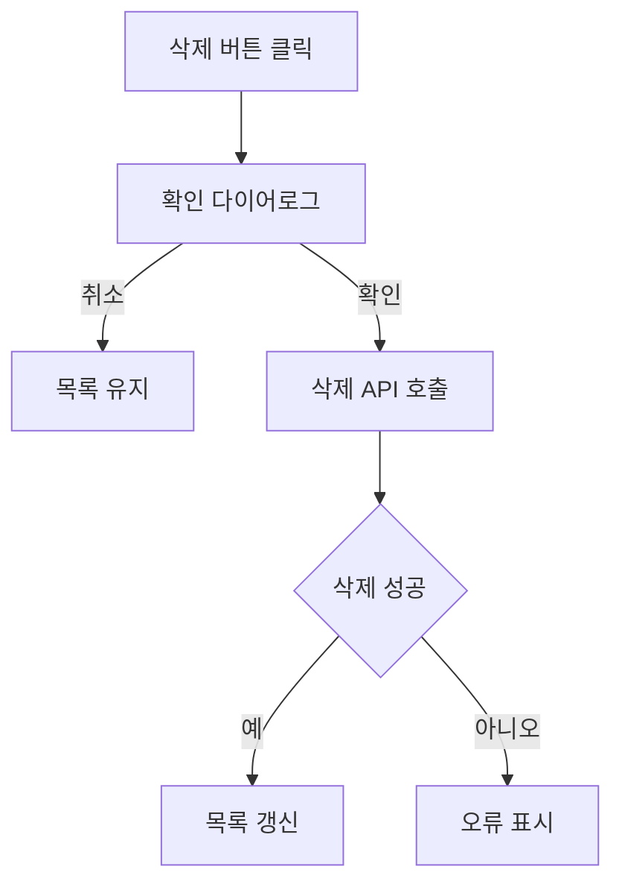

# 업무 등록 형식

Codex가 구현 계획을 Towercrane PMS 업무로 등록하기 위한 Markdown 형식입니다.

## 파일 이름 규칙

```txt
{기능명}에 대한 업무 등록.md
```

예:

```txt
프로토 타입 워크 스페이스 삭제에 대한 업무 등록.md
```

## Frontmatter

```md
---
title: 프로토타입 워크스페이스 삭제 기능 구현
taskType: FEATURE
priority: MEDIUM
workspaceId: task-workspace-default
---
```

## 필수 섹션

```md
# {기능명} 구현

## 업무 배경

## 완료 기준

## 단계별 계획

## 예상 파일 구조

## 체크리스트

## MMD
```

## 섹션별 작성 규칙

### 업무 배경

왜 이 업무가 필요한지, 현재 화면/기능에서 어떤 문제가 있는지 2~4문장으로 씁니다.

### 완료 기준

완료 여부를 판단할 수 있는 사용자 관점 결과를 bullet로 작성합니다.

```md
- 삭제 버튼이 권한 있는 사용자에게만 보인다.
- 삭제 확인 다이어로그에서 대상 워크스페이스 이름을 보여준다.
- 삭제 성공 후 목록이 갱신된다.
- 실패 시 오류 메시지가 표시된다.
```

### 단계별 계획

구현 순서대로 번호 목록을 씁니다. 각 단계는 한 줄 기준으로 짧게 둡니다.

```md
1. 현재 페이지와 API 훅 구조를 확인한다.
2. 삭제 버튼 노출 조건을 정리한다.
3. 삭제 확인 다이어로그를 구현한다.
4. 삭제 mutation과 캐시 갱신을 연결한다.
5. 서버 삭제 API와 권한 검증을 확인한다.
6. 성공/실패/권한 없음 케이스를 검증한다.
```

### 예상 파일 구조

업무 상세 화면에서는 폴더 구조 도식화가 읽기 좋습니다. 실제로 수정할 가능성이 높은 파일만 넣습니다.

```txt
.
├── towercrane-for-uiux-front
│   └── src
│       ├── pages
│       │   └── prototype-workspace
│       │       └── ui
│       │           └── prototype-workspace-home-page.tsx
│       └── entities
│           └── prototype-workspace
│               ├── api
│               │   └── prototype-workspace-api.ts
│               └── model
│                   └── types.ts
└── towercrane-for-uiux-server
    └── src
        └── prototype-workspaces
            ├── prototype-workspaces.controller.ts
            ├── prototype-workspaces.service.ts
            └── prototype-workspaces.schemas.ts
```

### 체크리스트

실행 가능한 작업 단위로 짧게 작성합니다.

```md
- 현재 구조 확인
- 권한 조건 확인
- 삭제 확인 다이어로그 구현
- 삭제 API 연동
- 캐시 갱신 처리
- 오류 메시지 처리
- 로컬 검증
```

### MMD

업무 흐름을 한눈에 볼 수 있는 Mermaid를 넣습니다.



## 등록 방식

Codex에 아래처럼 요청합니다.

```txt
/pms-task-register /Users/terecal/towercrane-for-uiux/pms-task/pms-task-register
```

또는 특정 파일을 직접 지정해도 됩니다.

```txt
이 파일을 기반으로 PMS 업무 등록해줘:
/Users/terecal/towercrane-for-uiux/pms-task/pms-task-register/프로토 타입 워크 스페이스 삭제에 대한 업무 등록.md
```

## 금지

- 완료 기준과 계획을 한 섹션에 섞기
- 파일 구조에 관련 없는 후보 파일을 과하게 넣기
- 단계별 계획을 긴 문단으로 작성하기
- MMD에 너무 많은 노드를 넣어 읽기 어렵게 만들기
