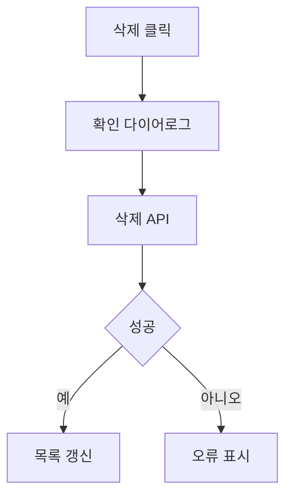

# 코드 리뷰 형식

Codex가 특정 기능이나 커밋을 리뷰한 뒤 Towercrane 코드 리뷰 게시판에 업로드하기 위한 Markdown 형식입니다.

## 파일 이름 규칙

```txt
{기능명}에 대한 코드 리뷰.md
```

예:

```txt
프로토 타입 워크 스페이스 삭제에 대한 코드 리뷰.md
```

## Frontmatter

파일 상단에 아래 값을 넣습니다. `sourceUrl`은 커밋 기반 리뷰이면 실제 GitHub commit URL을 넣고, 아직 커밋 전이면 임시 URL을 넣어도 됩니다.

```md
---
title: 프로토타입 워크스페이스 삭제 기능 코드 리뷰
sourceUrl: https://github.com/owner/repo/commit/sha
repository: owner/repo
riskLevel: low
model: codex
---
```

## 필수 섹션

```md
# {기능명} 코드 리뷰

## 전체 요약

## 변경 파일

## 주요 프로세스

## 주요 로직

## 핵심 문법

## 아키텍처/클린코드

## 검증

## 리스크

## MMD
```

## 섹션별 작성 규칙

### 전체 요약

기능의 목적, 변경 흐름, 가장 중요한 검토 포인트를 3~5문장으로 씁니다.

### 변경 파일

변경 파일은 단순 경로 목록보다 폴더 구조 도식화가 좋습니다. 실제 변경 파일만 포함하고, 가능하면 `(+추가/-삭제)` 또는 역할을 짧게 붙입니다.

```txt
.
├── towercrane-for-uiux-front
│   └── src
│       ├── pages
│       │   └── prototype-workspace
│       │       └── ui
│       │           └── prototype-workspace-home-page.tsx
│       └── entities
│           └── prototype-workspace
│               └── api
│                   └── prototype-workspace-api.ts
└── towercrane-for-uiux-server
    └── src
        └── prototype-workspaces
            ├── prototype-workspaces.controller.ts
            └── prototype-workspaces.service.ts
```

권장 문장은 섹션 마지막에 한 줄만 둡니다.

### 주요 프로세스

코드 없이 사용자 액션부터 서버 처리, 화면 갱신까지 번호 목록으로 씁니다.

```md
1. 사용자가 워크스페이스 카드의 삭제 버튼을 누른다.
2. 삭제 확인 다이어로그가 열린다.
3. 확인 시 delete mutation이 실행된다.
4. 서버가 권한과 워크스페이스 존재 여부를 검증한다.
5. 삭제 성공 후 프론트가 목록 쿼리를 무효화한다.
6. 실패하면 오류 메시지를 표시한다.
```

### 주요 로직

주요 로직은 절차별 + 주요 함수별로 작성합니다. 단계 제목은 “무슨 코드인가”를 먼저 쓰고, 함수명은 괄호 안에 보조로 넣습니다.

형식:

```md
#### 단계 1. 삭제 버튼 노출 조건 (함수 컴포넌트: PrototypeWorkspaceCard)

```ts
// 코드 3~12줄
```

이 코드가 맡는 역할을 한두 문장으로 설명한다.

→ 다음에 적용할 수 있는 구체적인 개선 방향을 쓴다.

---
```

규칙:

- 각 단계는 `#### 단계 n.`으로 시작합니다.
- 코드 블록은 3~12줄 정도로 짧게 유지합니다.
- 코드 블록에는 의도를 읽을 수 있는 주석을 1~2개만 넣습니다.
- 단계 사이에는 `---` 구분선을 넣습니다.
- import 목록, type 선언만으로 단계를 만들지 않습니다.

### 핵심 문법

기능 이해에 중요한 패턴이 있으면 하나만 깊게 설명합니다. 없으면 정확히 아래 문장만 씁니다.

```txt
핵심 문법 없음.
```

예:

```md
문법 1. TanStack Query mutation

```ts
const deleteMutation = useMutation({
  mutationFn: deleteWorkspace,
  onSuccess: () => queryClient.invalidateQueries({ queryKey: workspaceKeys.lists() }),
})
```

보충 설명: 서버 변경 요청과 화면 캐시 갱신을 연결하는 핵심 패턴입니다.
```

### 아키텍처/클린코드

레이어 경계, 책임 분리, 파일 크기, 중복, 명명, 유지보수성을 짧게 평가합니다.

### 검증

실제로 확인한 항목과 남은 테스트 공백을 분리합니다.

### 리스크

배포 전 확인해야 할 데이터 손실, 권한, 캐시, 장애 복구 리스크를 씁니다.

### MMD

Mermaid 원문만 넣습니다. 첫 줄은 `flowchart TD`로 시작합니다.



## 금지

- 변경 파일을 단순 긴 줄 목록으로만 나열
- 주요 로직에 함수명만 나열
- 코드 없이 일반론만 작성
- import, type/interface 선언만 길게 인용
- 테스트 부족만 반복 지적
- 커밋/기능과 직접 관련 없는 조언
