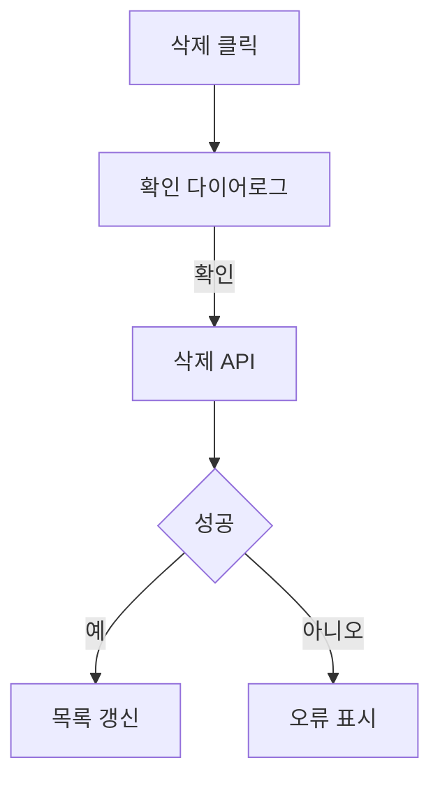

# 코드 리뷰 형식

Towercrane `코드 리뷰 게시판` 또는 업무 상세의 `리뷰` 탭에 파일로 등록하기 위한 Markdown 형식입니다.

## 파일 이름

```txt
{기능명}에 대한 코드 리뷰.md
```

예:

```txt
프로토 타입 워크 스페이스 삭제에 대한 코드 리뷰.md
```

## Frontmatter

```md
---
title: 프로토타입 워크스페이스 삭제 기능 코드 리뷰
taskId: task-xxxxxxxx-xxx
sourceUrl: https://github.com/owner/repo/commit/sha
repository: owner/repo
riskLevel: low
model: codex
---
```

규칙:

- `taskId`는 특정 업무와 바로 연결할 때만 넣습니다.
- `sourceUrl`은 커밋 URL이 있으면 GitHub commit URL을 넣고, 없으면 생략해도 됩니다.
- `riskLevel`은 `low`, `medium`, `high` 중 하나를 씁니다.
- 업무 상세에서 파일로 등록하면 등록된 리뷰가 해당 업무와 연결됩니다.

## 권장 섹션

아래 제목을 그대로 쓰면 코드 리뷰 화면이 가장 안정적으로 나옵니다.

```md
# {기능명} 코드 리뷰

## 전체 요약

## 변경 파일

## 주요 프로세스

## 주요 로직

## 핵심 문법

## 아키텍처/클린코드

## 검증

## 리스크

## MMD
```

## 작성 예시

````md
---
title: 프로토타입 워크스페이스 삭제 기능 코드 리뷰
sourceUrl: https://github.com/dota-pilot1/towercrane-for-uiux/commit/example
repository: dota-pilot1/towercrane-for-uiux
riskLevel: medium
model: codex
---

# 프로토타입 워크스페이스 삭제 기능 코드 리뷰

## 전체 요약

워크스페이스 카드에서 삭제 액션을 시작하고, 확인 다이어로그를 거쳐 서버 삭제 API를 호출한 뒤 목록 캐시를 갱신하는 흐름을 검토했다.
핵심 검토 포인트는 삭제 권한, 연관 데이터 처리, 실패 시 복구 가능한 UI 상태, 캐시 무효화 범위다.

## 변경 파일

```txt
.
├── towercrane-for-uiux-front
│   └── src
│       ├── pages
│       │   └── prototype-workspace
│       │       └── ui
│       │           └── prototype-workspace-home-page.tsx
│       └── entities
│           └── prototype-workspace
│               └── api
│                   └── prototype-workspace-api.ts
└── towercrane-for-uiux-server
    └── src
        └── prototype-workspaces
            ├── prototype-workspaces.controller.ts
            └── prototype-workspaces.service.ts
```

권장: 프론트 버튼, API 훅, 서버 controller/service가 하나의 삭제 흐름으로 연결되는지 확인하세요.

## 주요 프로세스

1. 사용자가 워크스페이스 카드의 삭제 버튼을 누른다.
2. 삭제 확인 다이어로그가 열린다.
3. 확인 시 delete mutation이 실행된다.
4. 서버가 권한과 워크스페이스 존재 여부를 검증한다.
5. 삭제 성공 후 프론트가 목록 쿼리를 무효화한다.
6. 실패하면 오류 메시지를 표시한다.

## 주요 로직

#### 단계 1. 삭제 버튼 노출 조건 (컴포넌트: PrototypeWorkspaceCard)

```tsx
const canManage = workspace.role === 'owner'

{canManage ? (
  <DeleteWorkspaceDialog workspace={workspace} />
) : null}
```

설명: 소유자 권한을 기준으로 삭제 액션을 노출한다.

개선 방향: 서버 권한 검증과 프론트 노출 조건이 같은 기준을 쓰는지 확인한다.

---

#### 단계 2. 삭제 요청과 캐시 갱신 (훅: useDeletePrototypeWorkspace)

```ts
await deleteWorkspace.mutateAsync(workspace.id)
queryClient.invalidateQueries({ queryKey: prototypeWorkspaceKeys.lists() })
```

설명: 삭제 성공 후 목록 캐시를 무효화해 화면을 최신 상태로 맞춘다.

개선 방향: 삭제 실패 시 다이어로그 상태와 에러 메시지가 유지되는지 확인한다.

## 핵심 문법

문법 1. TanStack Query mutation

```ts
const deleteMutation = useMutation({
  mutationFn: deleteWorkspace,
  onSuccess: () => queryClient.invalidateQueries({ queryKey: workspaceKeys.lists() }),
})
```

보충 설명: 서버 변경 요청과 화면 캐시 갱신을 연결하는 핵심 패턴입니다.

## 아키텍처/클린코드

삭제 확인 UI, API 호출, 서버 권한 검증이 각각의 레이어에 분리되어 있는지 확인한다.
컴포넌트가 커지면 삭제 버튼과 다이어로그를 별도 feature 컴포넌트로 분리하는 편이 좋다.

## 검증

- 삭제 성공 후 목록에서 카드가 사라지는지 확인
- 삭제 실패 시 오류 메시지가 표시되는지 확인
- 권한 없는 사용자가 삭제할 수 없는지 확인

## 리스크

- 연관 카테고리/프로토타입 데이터가 의도와 다르게 삭제될 수 있다.
- 캐시 무효화 범위가 부족하면 삭제된 카드가 화면에 남을 수 있다.
- 서버 권한 검증이 빠지면 프론트 우회 요청으로 삭제될 수 있다.

## MMD


````

## 파싱 규칙

- `전체 요약`은 리뷰 카드와 상세 요약으로 사용됩니다.
- `변경 파일`, `주요 프로세스`, `주요 로직`, `핵심 문법`, `아키텍처/클린코드`, `리스크`, `MMD`는 각각 검토 항목으로 변환됩니다.
- `검증`, `테스트`, `Tests` 섹션은 테스트 공백 또는 검증 정보로 처리됩니다.
- `변경 파일`은 ```txt fenced code block의 폴더 구조를 권장합니다.
- `주요 로직`은 `#### 단계 n.` 단위로 짧은 코드와 설명을 함께 둡니다.

## 금지

- 변경 파일을 한 줄 경로 목록으로만 길게 나열하기
- 주요 로직에 함수명만 나열하고 코드/설명을 생략하기
- import, type/interface 선언만 길게 인용하기
- 테스트 부족만 반복 지적하기
- 커밋/기능과 직접 관련 없는 일반론 쓰기
