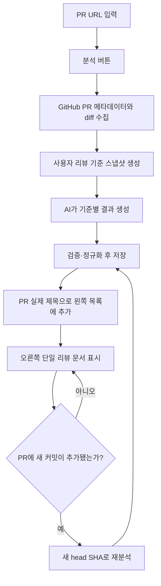

# GitHub PR Review 구현 계획

## 결론

구현 가능하다. 참고 화면의 `프로젝트 → 1차 주제 → 2차 주제 → 노트` 구조를 그대로 복제하지 않고, GitHub PR 리뷰에 맞게 아래처럼 줄이는 것이 적합하다.

```text
GitHub PR Review
├─ 상단: PR URL 입력 + 분석 + 리뷰 기준 설정
├─ 왼쪽: 분석한 PR 목록
└─ 오른쪽: 선택한 PR의 단일 리뷰 문서
```

- PR 한 건이 곧 하나의 1차 주제다.
- 목록 제목은 AI가 만들지 않고 GitHub의 실제 PR 제목을 사용한다.
- 2차 주제와 별도 노트 목록은 만들지 않는다.
- 리뷰 기준 이름도 AI가 만들지 않는다. 사용자가 저장한 기준 이름을 그대로 쓴다.
- AI는 각 리뷰 기준에 대해 `문제 발견 / 주의 / 발견 없음 / 해당 없음`과 근거·위치·개선안을 채운다.
- 최종 승인 여부는 사람이 결정한다. 이 기능은 1차 검토 보조 도구이며 GitHub에 Approve나 코멘트를 자동 등록하지 않는다.

## 권장 화면

```text
┌───────────────────────────────────────────────────────────────────────────┐
│ GitHub PR Review                                                          │
│ [ https://github.com/owner/repo/pull/123                         ] [분석] │
│ [이번 리뷰 참고사항(선택)]                         [리뷰 기준 6개 설정 ⚙] │
├───────────────────────┬───────────────────────────────────────────────────┤
│ PR 리뷰               │ owner/repo #123                   [GitHub에서 열기]│
│ [검색]                │ PR 실제 제목                                      │
│                       │ feature/login → main · OPEN · head SHA             │
│ ● #123 로그인 개선    ├───────────────────────────────────────────────────┤
│   문제 2 · 주의 1     │ 전체 요약                                          │
│   5분 전               │                                                   │
│                       │ 리뷰 기준 결과                                     │
│ ○ #119 토큰 갱신      │ 1. 정확성/기능       문제 발견 1                   │
│   발견 없음           │    - 파일:라인 / 근거 / 개선안                     │
│                       │ 2. 보안               주의 1                       │
│                       │ 3. 예외 처리          발견 없음                    │
│                       │ 4. 구조/유지보수성    ...                           │
│                       │ 5. 성능/동시성        ...                           │
│                       │ 6. 테스트/회귀        ...                           │
└───────────────────────┴───────────────────────────────────────────────────┘
```

모바일에서는 PR 목록을 상단 드롭다운 또는 드로어로 전환하고 본문을 한 열로 표시한다.

## 사용자 흐름



## 현재 코드에서 재사용할 것

이미 웹 코드 리뷰 기능에 다음 기반이 있다.

- 프론트 화면: `towercrane-for-uiux-front/src/pages/code-reviews/ui/code-reviews-page.tsx`
- 프론트 API/타입: `towercrane-for-uiux-front/src/entities/code-review/`
- 서버 분석 API: `POST /api/code-reviews/analyze`
- 서버 분석 엔진: `towercrane-for-uiux-server/src/code-reviews/code-reviews.service.ts`
- GitHub PR URL 파싱, diff 수집, PR head SHA 조회, 변경 파일 전체 내용 및 연관 파일 수집
- OpenAI 구조화 응답, 휴리스틱 폴백, 리뷰 저장 및 중복 검사
- DB 테이블: `code_reviews`
- 라우트: `/code-reviews`, `/code-reviews/:reviewId`

따라서 새 분석기를 복제하지 않는다. 기존 엔진을 작은 서비스들로 분리해 재사용하고, PR 전용 메타데이터·리뷰 기준 계약·간결한 UI를 추가한다.

참고 이미지의 수동 노트 구조는
`towercrane-springboot-architecture-tauri/src/widgets/project-code-review/ProjectCodeReviewModule.tsx`
에 있으나, 이 기능에는 계층과 편집기를 가져오지 않고 2열 레이아웃 감각만 참고한다.

## 제품 및 기술 결정

| 항목 | 결정 |
|---|---|
| 사용자 공개 경로 | `/github-pr-review` |
| 메뉴 `sectionId` | `github_pr_review` |
| 과거 `/code-reviews` | 당장은 유지하고 이후 새 화면으로 redirect 여부 결정 |
| 분석 단위 | GitHub Pull Request만 허용 |
| 제목 | GitHub PR의 실제 `title` |
| 왼쪽 목록 | 분석 완료된 PR 리뷰 히스토리 |
| 오른쪽 본문 | 한 PR당 단일 리뷰 문서 |
| 리뷰 기준 | 사용자별 저장, 순서·활성 여부·지침 편집 가능 |
| 일회성 컨텍스트 | `이번 리뷰 참고사항` 선택 입력 |
| 결과 제목 | 사용자 기준 제목을 그대로 사용 |
| GitHub 쓰기 | MVP에서 없음. 조회 전용 |
| AI 장애 | 실패를 명시하고 저장하지 않음. 휴리스틱 결과를 AI 결과처럼 위장하지 않음 |
| PR 갱신 | `headSha + 기준 스냅샷 + 참고사항`이 달라지면 새 분석 버전 생성 |
| 테마 | semantic token 및 `ui-*` 유틸만 사용 |

## MVP 범위

포함:

- GitHub PR URL 유효성 검사
- PR 제목, 번호, 상태, 작성자, base/head branch, head SHA 조회
- 공개 저장소 및 서버 `GITHUB_TOKEN`으로 접근 가능한 저장소 분석
- 사용자별 리뷰 기준 설정
- 선택된 기준과 일회성 참고사항을 함께 전달
- 기준별 구조화 결과와 파일/라인 근거 표시
- PR 리뷰 히스토리 검색, 상세 조회, 삭제, 재분석
- PR에 새 커밋이 추가된 경우 오래된 리뷰 표시

제외:

- GitHub OAuth/GitHub App 설치 UI
- GitHub PR 코멘트/Approve/Request changes 자동 작성
- CI 체크 실행 또는 병합
- 여러 명의 실시간 공동 편집
- 2차 주제, 노트 목록, 범용 문서 편집기
- commit/compare URL 분석 화면

비공개 저장소를 사용자별 권한으로 다뤄야 하면 MVP 이후 GitHub App 방식으로 확장한다. 브라우저나 DB에 평문 PAT를 저장하는 방식은 사용하지 않는다.

## 문서

- [상세 구현 계획](./PLAN.md)
- [리뷰 기준 및 AI 응답 계약](./REVIEW-CONTRACT.md)
